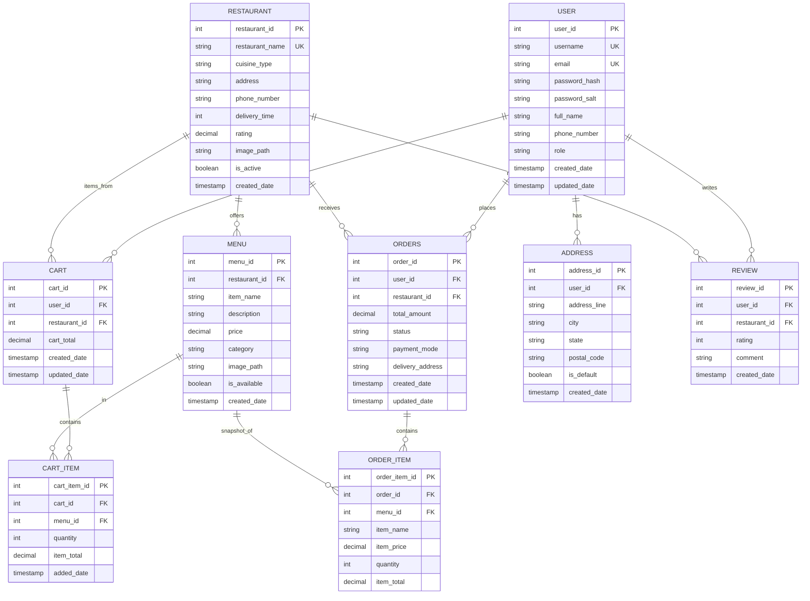

# Entity Relationship Diagram (ERD) Document
## JEE Food App - Database Structure and Relationships

**Version:** 1.0  
**Date:** December 2024  
**Database Team:** Development Team  

---

## Overview

This document presents the Entity Relationship Diagram (ERD) for the JEE Food App database, showing all entities, their attributes, and relationships using Mermaid syntax.

## Complete ERD



## Entity Definitions

### 1. USER Entity

**Purpose:** Store user account information and authentication credentials

**Attributes:**
| Attribute | Type | Constraint | Description |
|-----------|------|-----------|-------------|
| user_id | INT | PK, AUTO_INCREMENT | Unique user identifier |
| username | VARCHAR(50) | UNIQUE, NOT NULL | Unique username for login |
| email | VARCHAR(100) | UNIQUE, NOT NULL | Unique email address for communication |
| password_hash | VARCHAR(255) | NOT NULL | SHA-256 hashed password |
| password_salt | VARCHAR(255) | NOT NULL | Random salt for password security |
| full_name | VARCHAR(100) | NULLABLE | User's full name for display |
| phone_number | VARCHAR(15) | NULLABLE | Contact phone number |
| role | VARCHAR(20) | NOT NULL, DEFAULT 'CUSTOMER' | User role (CUSTOMER, ADMIN) |
| created_date | TIMESTAMP | DEFAULT CURRENT_TIMESTAMP | Account creation date |
| updated_date | TIMESTAMP | ON UPDATE CURRENT_TIMESTAMP | Last update timestamp |

**Business Rules:**
- Email and username must be globally unique
- Password stored as hash with unique salt per user
- Role determines application access level

### 2. RESTAURANT Entity

**Purpose:** Store restaurant information and operational details

**Attributes:**
| Attribute | Type | Constraint | Description |
|-----------|------|-----------|-------------|
| restaurant_id | INT | PK, AUTO_INCREMENT | Unique restaurant identifier |
| restaurant_name | VARCHAR(100) | UNIQUE, NOT NULL | Restaurant name |
| cuisine_type | VARCHAR(50) | NOT NULL | Type of cuisine (Italian, Chinese, etc.) |
| address | TEXT | NOT NULL | Full restaurant address |
| phone_number | VARCHAR(15) | NULLABLE | Restaurant contact number |
| delivery_time | INT | NOT NULL, CHECK > 0 | Average delivery time in minutes |
| rating | DECIMAL(3,2) | CHECK 0-5 | Average customer rating (0.00 to 5.00) |
| image_path | VARCHAR(255) | NULLABLE | Path to restaurant image file |
| is_active | BOOLEAN | DEFAULT TRUE | Whether restaurant accepts orders |
| created_date | TIMESTAMP | DEFAULT CURRENT_TIMESTAMP | Registration date |

**Business Rules:**
- Only active restaurants displayed to customers
- Ratings maintained as running average from reviews
- Delivery time must be positive integer

### 3. MENU Entity

**Purpose:** Store menu items offered by each restaurant

**Attributes:**
| Attribute | Type | Constraint | Description |
|-----------|------|-----------|-------------|
| menu_id | INT | PK, AUTO_INCREMENT | Unique menu item identifier |
| restaurant_id | INT | FK, NOT NULL | Reference to parent restaurant |
| item_name | VARCHAR(100) | NOT NULL | Name of menu item |
| description | TEXT | NULLABLE | Detailed item description |
| price | DECIMAL(10,2) | NOT NULL, CHECK >= 0 | Item price in currency |
| category | VARCHAR(50) | NULLABLE | Item category (Appetizers, Main, etc.) |
| image_path | VARCHAR(255) | NULLABLE | Path to item image file |
| is_available | BOOLEAN | DEFAULT TRUE | Whether item is currently available |
| created_date | TIMESTAMP | DEFAULT CURRENT_TIMESTAMP | Item creation date |

**Relationships:**
- FK to RESTAURANT (CASCADE delete)
- One-to-Many with CART_ITEM
- One-to-Many with ORDER_ITEM

**Business Rules:**
- Each menu item belongs to exactly one restaurant
- Only available items shown to customers
- Prices always stored with 2 decimal places

### 4. CART Entity

**Purpose:** Store shopping carts (primarily session-based in current implementation)

**Attributes:**
| Attribute | Type | Constraint | Description |
|-----------|------|-----------|-------------|
| cart_id | INT | PK, AUTO_INCREMENT | Unique cart identifier |
| user_id | INT | FK, NOT NULL | Reference to user |
| restaurant_id | INT | FK, NOT NULL | Reference to restaurant |
| cart_total | DECIMAL(10,2) | DEFAULT 0.00 | Total cart value |
| created_date | TIMESTAMP | DEFAULT CURRENT_TIMESTAMP | Cart creation date |
| updated_date | TIMESTAMP | ON UPDATE CURRENT_TIMESTAMP | Last modification date |

**Relationships:**
- FK to USER (CASCADE delete)
- FK to RESTAURANT (CASCADE delete)
- One-to-Many with CART_ITEM
- UNIQUE constraint on (user_id, restaurant_id)

**Business Rules:**
- One active cart per user per restaurant
- Cart data typically stored in HTTP session, not database
- Unique constraint prevents multiple carts for same user-restaurant pair

### 5. CART_ITEM Entity

**Purpose:** Store individual items within shopping carts

**Attributes:**
| Attribute | Type | Constraint | Description |
|-----------|------|-----------|-------------|
| cart_item_id | INT | PK, AUTO_INCREMENT | Unique cart item identifier |
| cart_id | INT | FK, NOT NULL | Reference to parent cart |
| menu_id | INT | FK, NOT NULL | Reference to menu item |
| quantity | INT | NOT NULL, CHECK 1-99 | Number of items |
| item_total | DECIMAL(10,2) | NOT NULL | Total for this item (qty × price) |
| added_date | TIMESTAMP | DEFAULT CURRENT_TIMESTAMP | When item was added |

**Relationships:**
- FK to CART (CASCADE delete)
- FK to MENU (CASCADE delete)
- UNIQUE constraint on (cart_id, menu_id)

**Business Rules:**
- Each menu item appears at most once per cart
- Quantity between 1 and 99
- Item total automatically calculated

### 6. ORDERS Entity

**Purpose:** Store completed customer orders

**Attributes:**
| Attribute | Type | Constraint | Description |
|-----------|------|-----------|-------------|
| order_id | INT | PK, AUTO_INCREMENT | Unique order identifier |
| user_id | INT | FK, NOT NULL | Reference to customer |
| restaurant_id | INT | FK, NOT NULL | Reference to fulfilling restaurant |
| total_amount | DECIMAL(10,2) | NOT NULL | Final order total (items + fees + tax) |
| status | VARCHAR(50) | NOT NULL, DEFAULT 'Confirmed' | Order status |
| payment_mode | VARCHAR(50) | NOT NULL | Payment method used |
| delivery_address | TEXT | NOT NULL | Full delivery address |
| created_date | TIMESTAMP | DEFAULT CURRENT_TIMESTAMP | Order placement date |
| updated_date | TIMESTAMP | ON UPDATE CURRENT_TIMESTAMP | Last status update |

**Relationships:**
- FK to USER (RESTRICT delete - preserve order history)
- FK to RESTAURANT (RESTRICT delete - preserve order records)
- One-to-Many with ORDER_ITEM

**Business Rules:**
- Orders cannot be deleted (RESTRICT foreign key)
- Status progression: Confirmed → Pending → Preparing → Out for Delivery → Delivered
- Total amount includes items + delivery fee + taxes

**Status Values:**
- `Confirmed`: Order placed and payment confirmed
- `Pending`: Order received by restaurant
- `Preparing`: Restaurant preparing order
- `Out for Delivery`: Order dispatched
- `Delivered`: Order successfully delivered
- `Cancelled`: Order cancelled

### 7. ORDER_ITEM Entity

**Purpose:** Store individual items within completed orders

**Attributes:**
| Attribute | Type | Constraint | Description |
|-----------|------|-----------|-------------|
| order_item_id | INT | PK, AUTO_INCREMENT | Unique order item identifier |
| order_id | INT | FK, NOT NULL | Reference to parent order |
| menu_id | INT | FK, NOT NULL | Reference to original menu item |
| item_name | VARCHAR(100) | NOT NULL | Snapshot of item name |
| item_price | DECIMAL(10,2) | NOT NULL | Snapshot of item price at order time |
| quantity | INT | NOT NULL | Quantity ordered |
| item_total | DECIMAL(10,2) | NOT NULL | Total for this item (qty × price) |

**Relationships:**
- FK to ORDERS (RESTRICT delete - preserve order records)
- FK to MENU (RESTRICT delete - preserve menu references)

**Business Rules:**
- Stores snapshot of menu details at time of order
- Prevents data loss if menu items are later modified
- Item total must equal quantity × item_price

### 8. ADDRESS Entity

**Purpose:** Store multiple delivery addresses per user

**Attributes:**
| Attribute | Type | Constraint | Description |
|-----------|------|-----------|-------------|
| address_id | INT | PK, AUTO_INCREMENT | Unique address identifier |
| user_id | INT | FK, NOT NULL | Reference to user |
| address_line | TEXT | NOT NULL | Street address and apartment/unit |
| city | VARCHAR(100) | NOT NULL | City name |
| state | VARCHAR(100) | NOT NULL | State or province |
| postal_code | VARCHAR(20) | NOT NULL | ZIP or postal code |
| is_default | BOOLEAN | DEFAULT FALSE | Whether this is default address |
| created_date | TIMESTAMP | DEFAULT CURRENT_TIMESTAMP | Address creation date |

**Relationships:**
- FK to USER (CASCADE delete)
- One-to-Many relationship with USER

**Business Rules:**
- Users can have multiple saved addresses
- Only one default address per user
- Deleted when user account is deleted

### 9. REVIEW Entity

**Purpose:** Store customer reviews and ratings for restaurants

**Attributes:**
| Attribute | Type | Constraint | Description |
|-----------|------|-----------|-------------|
| review_id | INT | PK, AUTO_INCREMENT | Unique review identifier |
| user_id | INT | FK, NOT NULL | Reference to reviewer |
| restaurant_id | INT | FK, NOT NULL | Reference to reviewed restaurant |
| rating | INT | NOT NULL, CHECK 1-5 | Numeric rating 1-5 stars |
| comment | TEXT | NULLABLE | Optional review comment |
| created_date | TIMESTAMP | DEFAULT CURRENT_TIMESTAMP | Review submission date |

**Relationships:**
- FK to USER (CASCADE delete)
- FK to RESTAURANT (CASCADE delete)
- UNIQUE constraint on (user_id, restaurant_id)

**Business Rules:**
- One review per user per restaurant
- Rating must be 1-5 inclusive
- Reviews deleted when user or restaurant is deleted

## Relationship Types

### One-to-Many Relationships

```
USER ──── 1:Many ──── CART
USER ──── 1:Many ──── ORDERS
USER ──── 1:Many ──── ADDRESS
USER ──── 1:Many ──── REVIEW

RESTAURANT ──── 1:Many ──── MENU
RESTAURANT ──── 1:Many ──── CART
RESTAURANT ──── 1:Many ──── ORDERS
RESTAURANT ──── 1:Many ──── REVIEW

CART ──── 1:Many ──── CART_ITEM
ORDERS ──── 1:Many ──── ORDER_ITEM
```

### Many-to-One Relationships

```
CART_ITEM ──── Many:1 ──── MENU
ORDER_ITEM ──── Many:1 ──── MENU
```

## Key Constraints

### Primary Keys
All entities have surrogate primary keys using AUTO_INCREMENT integers.

### Unique Constraints
- `user.email`: Ensure unique email addresses
- `user.username`: Ensure unique usernames
- `restaurant.restaurant_name`: Ensure unique restaurant names
- `cart (user_id, restaurant_id)`: Prevent multiple carts per user-restaurant
- `cart_item (cart_id, menu_id)`: Prevent duplicate items in cart
- `review (user_id, restaurant_id)`: One review per user per restaurant

### Foreign Key Constraints
All foreign keys enforce referential integrity:
- CASCADE delete: CART, CART_ITEM, MENU, ADDRESS, REVIEW
- RESTRICT delete: ORDERS, ORDER_ITEM (preserve order history)

### Check Constraints
- `restaurant.delivery_time > 0`
- `restaurant.rating BETWEEN 0.00 AND 5.00`
- `menu.price >= 0.00`
- `cart_item.quantity BETWEEN 1 AND 99`
- `review.rating BETWEEN 1 AND 5`

## Data Integrity

### Referential Integrity
- All foreign keys must reference existing primary keys
- Cascade delete removes dependent records automatically
- Restrict delete prevents deletion of referenced records

### Domain Integrity
- Data types enforced at database level
- Check constraints ensure valid values
- NOT NULL constraints prevent missing required data

### Entity Integrity
- Primary keys ensure unique identification
- Unique constraints prevent duplicate entries
- Auto-increment ensures unique ID generation

---

**Document Status:** Approved  
**Next Review Date:** Q2 2025  
**Database Architecture:** Development Team, DBA Team