# System Architecture Document
## JEE Food App - Online Food Delivery Platform

**Version:** 1.0  
**Date:** December 2024  
**Architecture Team:** Development Team  

---

## Executive Summary

This document describes the system architecture of the JEE Food App, a web-based food delivery platform built using traditional Java Enterprise Edition technologies. The application follows a layered MVC architecture with clear separation of concerns, utilizing servlets for web tier, POJOs for business logic, and DAO pattern for data persistence.

## Architecture Overview

### High-Level Architecture

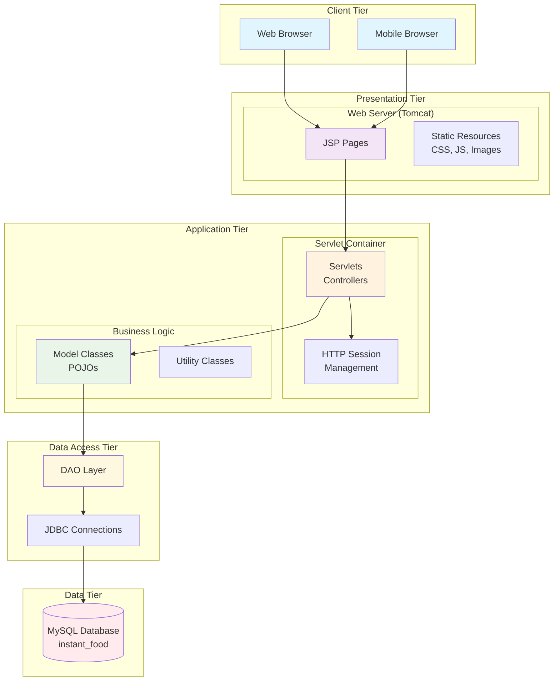

### Architecture Principles

1. **Separation of Concerns:** Clear distinction between presentation, business, and data layers
2. **Single Responsibility:** Each class and method has a single, well-defined purpose
3. **Dependency Inversion:** High-level modules don't depend on low-level modules
4. **Encapsulation:** Data and behavior are encapsulated within appropriate classes
5. **Scalability:** Architecture supports horizontal and vertical scaling
6. **Maintainability:** Code is organized for easy maintenance and updates

## Layered Architecture Design

### 1. Presentation Layer (View)

**Purpose:** Handle user interface and user interaction  
**Technologies:** JSP, HTML5, CSS3, JavaScript  
**Components:** Web pages, forms, stylesheets, client-side scripts  

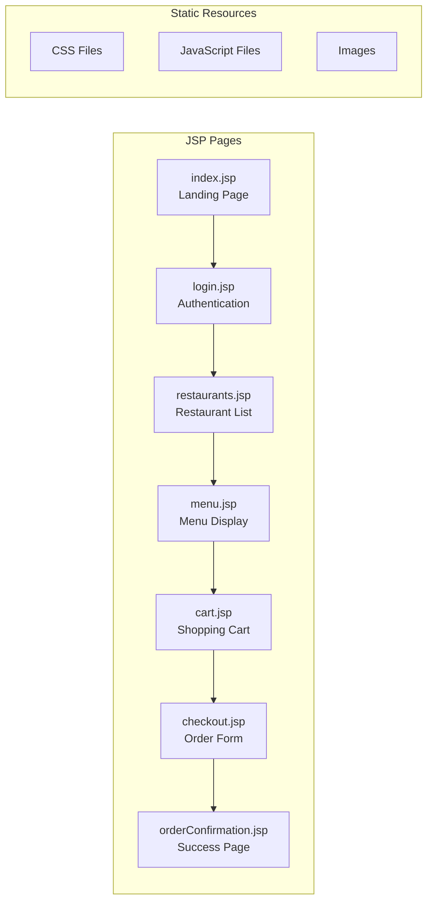

**Responsibilities:**
- Render dynamic HTML content using JSP
- Handle form submissions and user input
- Display data received from controllers
- Implement responsive design for mobile compatibility
- Provide client-side validation and interactivity

### 2. Web/Controller Layer (Controller)

**Purpose:** Handle HTTP requests and coordinate application flow  
**Technologies:** Java Servlets, HTTP Session  
**Components:** Servlet classes mapped to URL patterns  

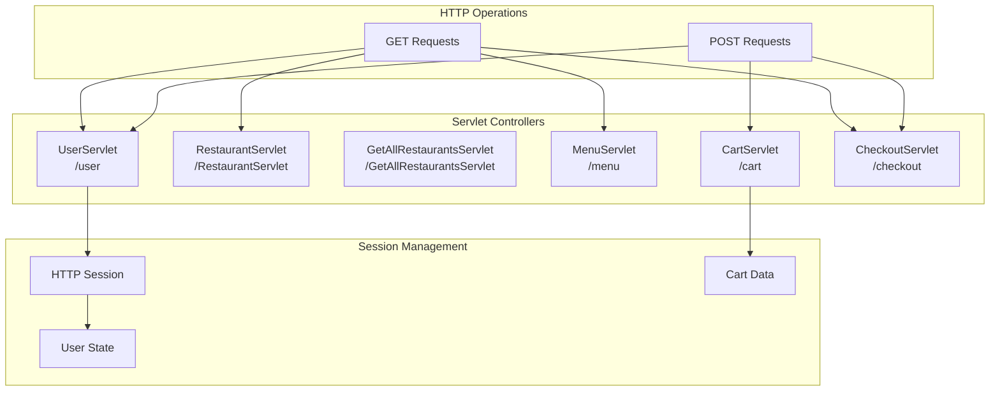

**Key Servlets:**

1. **UserServlet (`/user`)**
   - Login, logout, registration
   - Session management
   - Authentication handling

2. **RestaurantServlet (`/RestaurantServlet`)**
   - Display all restaurants
   - Restaurant filtering (future)
   - Restaurant details

3. **MenuServlet (`/menu`)**
   - Display restaurant menus
   - Menu item details
   - Category filtering

4. **CartServlet (`/cart`)**
   - Add items to cart
   - Update quantities
   - Remove items
   - Cart calculations

5. **CheckoutServlet (`/checkout`)**
   - Display checkout form
   - Process orders
   - Payment handling
   - Order confirmation

### 3. Business/Service Layer (Model)

**Purpose:** Implement business logic and data validation  
**Technologies:** Java POJOs, JavaBeans pattern  
**Components:** Entity classes, utility classes, business rules  

```mermaid
classDiagram
    class User {
        -int userId
        -String username
        -String email
        -String passwordHash
        -String passwordSalt
        -String role
        +getters/setters
        +toString()
    }
    
    class Restaurant {
        -int restaurantId
        -String restaurantName
        -String cuisineType
        -int deliveryTime
        -String address
        -double rating
        +getters/setters
    }
    
    class Menu {
        -int menuId
        -int restaurantId
        -String itemName
        -String description
        -double price
        -boolean isAvailable
        +getters/setters
    }
    
    class Cart {
        -int cartId
        -int userId
        -int restaurantId
        -double cartTotal
        -List~CartItem~ items
        +addItem()
        +removeItem()
        +calculateTotal()
    }
    
    class Order {
        -int orderId
        -int userId
        -int restaurantId
        -double totalAmount
        -String status
        -String paymentMode
        -String deliveryAddress
        +getters/setters
    }
    
    User ||--o{ Cart
    Restaurant ||--o{ Menu
    Cart ||--o{ CartItem
    User ||--o{ Order
    Order ||--o{ OrderItem
```

**Utility Classes:**
- **DBConnection:** Database connection management
- **PasswordUtil:** Password hashing and verification
- **CartHelper:** Cart operations and calculations
- **DataSeeder:** Database initialization with sample data

### 4. Data Access Layer (DAO)

**Purpose:** Handle database operations and data persistence  
**Technologies:** JDBC, PreparedStatements, MySQL  
**Components:** DAO interfaces and implementations  

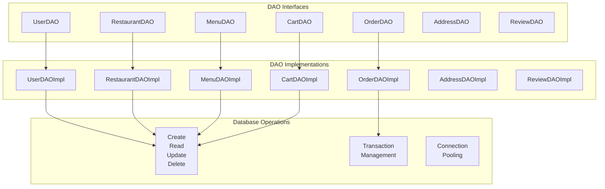

**DAO Pattern Benefits:**
- Abstraction of database operations
- Separation of data access logic from business logic
- Easy to unit test with mock implementations
- Database vendor independence
- Centralized SQL query management

### 5. Data Layer

**Purpose:** Data storage and retrieval  
**Technologies:** MySQL 8.0, InnoDB storage engine  
**Components:** Database tables, indexes, constraints, stored procedures  

## Component Interaction Flow

### 1. User Authentication Flow

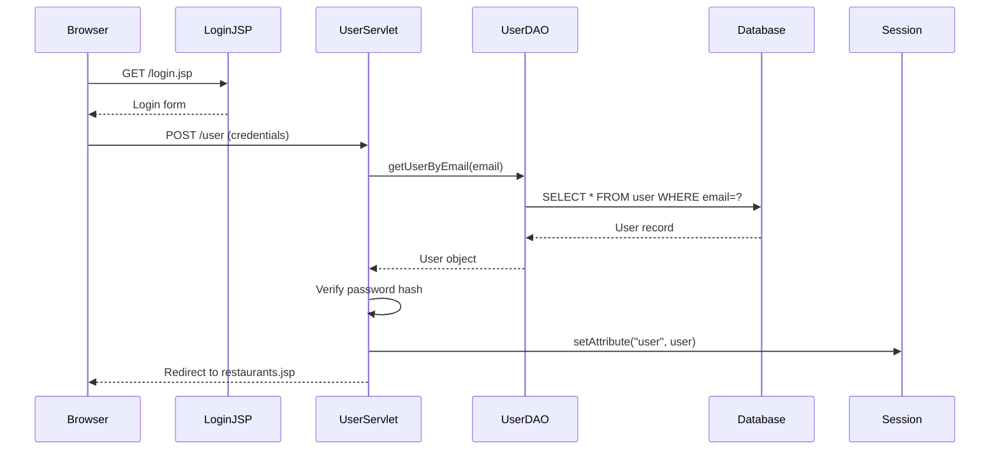

### 2. Restaurant Browsing Flow

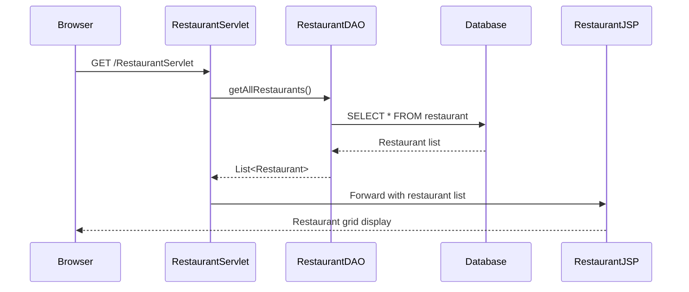

### 3. Cart Management Flow

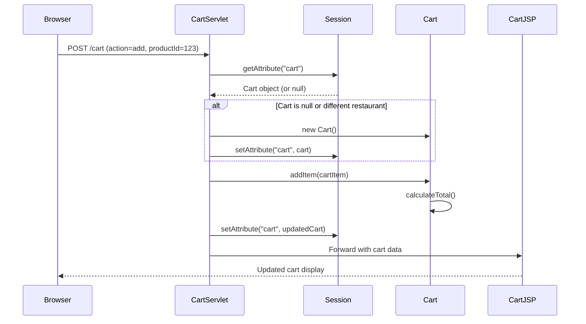

### 4. Order Processing Flow

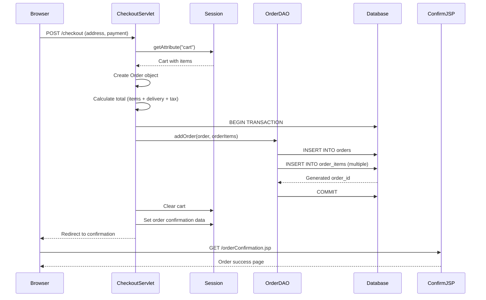

## Data Architecture

### Database Schema Design

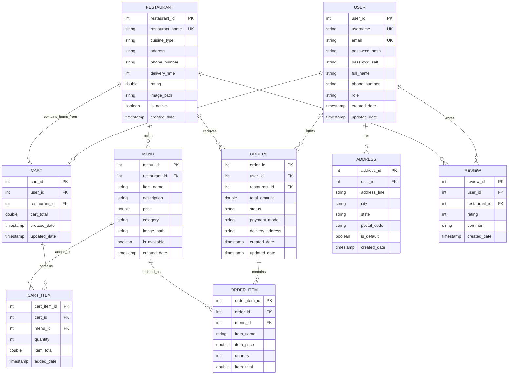

### Database Design Principles

1. **Normalization:** Database is normalized to 3NF to eliminate redundancy
2. **Referential Integrity:** Foreign key constraints maintain data consistency
3. **Indexing:** Strategic indexes on frequently queried columns
4. **Data Types:** Appropriate data types for storage efficiency
5. **Constraints:** Check constraints for data validation
6. **Timestamps:** Audit trails with created_date and updated_date

### Index Strategy

```sql
-- Primary Keys (automatically indexed)
-- user_id, restaurant_id, menu_id, order_id, etc.

-- Foreign Key Indexes
CREATE INDEX idx_menu_restaurant_id ON menu(restaurant_id);
CREATE INDEX idx_cart_user_id ON cart(user_id);
CREATE INDEX idx_orders_user_id ON orders(user_id);
CREATE INDEX idx_order_item_order_id ON order_item(order_id);

-- Search Optimization Indexes
CREATE INDEX idx_user_email ON user(email);
CREATE INDEX idx_restaurant_name ON restaurant(restaurant_name);
CREATE INDEX idx_menu_item_name ON menu(item_name);
CREATE INDEX idx_orders_status ON orders(status);
CREATE INDEX idx_orders_date ON orders(created_date);

-- Composite Indexes for Complex Queries
CREATE INDEX idx_menu_restaurant_available ON menu(restaurant_id, is_available);
CREATE INDEX idx_orders_user_date ON orders(user_id, created_date);
```

## Session Management Architecture

### Session Storage Strategy

The application uses HTTP sessions to maintain user state and shopping cart data:

```mermaid
graph TD
    subgraph "HTTP Session"
        USER_OBJ[User Object]
        CART_OBJ[Cart Object]
        RESTAURANT_ID[Restaurant ID]
        TEMP_DATA[Temporary Data]
    end
    
    subgraph "Session Lifecycle"
        CREATE[Session Creation]
        UPDATE[Session Update]
        VALIDATE[Session Validation]
        CLEANUP[Session Cleanup]
        EXPIRE[Session Expiration]
    end
    
    subgraph "Storage Contents"
        USER_DATA[userId, username, email, role]
        CART_DATA[cartId, restaurantId, items[], total]
        ORDER_DATA[orderId, orderTotal, deliveryFee, GST]
        ERROR_MSG[Error Messages]
        SUCCESS_MSG[Success Messages]
    end
    
    CREATE --> USER_OBJ
    UPDATE --> CART_OBJ
    VALIDATE --> USER_OBJ
    CLEANUP --> CART_OBJ
    EXPIRE --> USER_OBJ
    
    USER_OBJ --> USER_DATA
    CART_OBJ --> CART_DATA
    TEMP_DATA --> ORDER_DATA
    TEMP_DATA --> ERROR_MSG
    TEMP_DATA --> SUCCESS_MSG
```

### Session Management Rules

1. **User Authentication:**
   - User object stored in session after successful login
   - Session validated on protected pages
   - Session cleared on logout

2. **Cart Management:**
   - Cart stored as session attribute (not in database)
   - Single restaurant per cart enforced
   - Cart cleared when switching restaurants
   - Cart persists during user session

3. **Order Processing:**
   - Temporary order data stored in session during checkout
   - Session data cleared after order confirmation
   - Order permanently stored in database

4. **Session Security:**
   - 30-minute timeout for inactive sessions
   - Session ID regeneration on login
   - Secure session cookies in production

## Security Architecture

### Authentication and Authorization

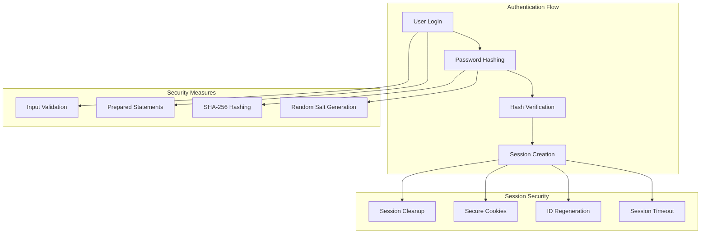

### Security Implementation Details

1. **Password Security:**
   - SHA-256 hashing with random salt
   - 16-byte salt generation using SecureRandom
   - Separate storage of hash and salt
   - Protection against rainbow table attacks

2. **SQL Injection Prevention:**
   - Prepared statements for all database queries
   - Parameter binding instead of string concatenation
   - Input validation and sanitization

3. **Session Security:**
   - HTTP-only session cookies
   - Secure flag for HTTPS connections
   - Session timeout after 30 minutes inactivity
   - Session ID regeneration on authentication

4. **Input Validation:**
   - Server-side validation for all form inputs
   - Type checking for numeric parameters
   - Length validation for string inputs
   - Email format validation

## Performance Architecture

### Response Time Optimization

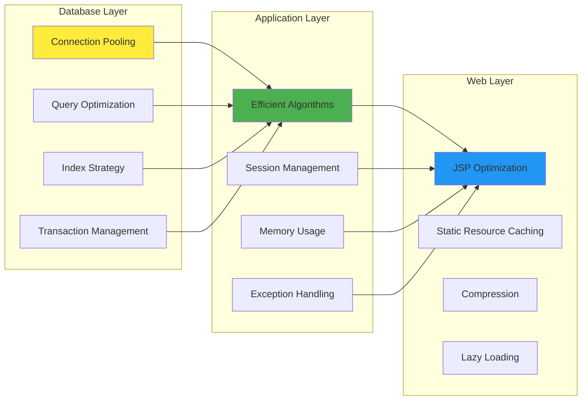

### Scalability Considerations

1. **Database Scalability:**
   - Efficient indexing strategy
   - Connection pooling (future implementation)
   - Query optimization and monitoring
   - Database clustering support

2. **Application Scalability:**
   - Stateless servlet design
   - Session externalization (future)
   - Load balancing support
   - Microservices migration path

3. **Caching Strategy:**
   - Application-level caching
   - Database query caching
   - Static resource caching
   - CDN integration (future)

## Error Handling Architecture

### Error Handling Strategy

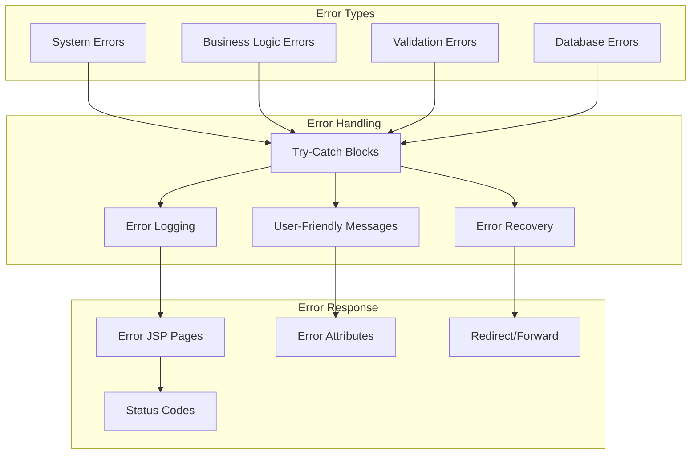

### Error Handling Implementation

1. **Exception Hierarchy:**
   - System exceptions logged with full stack traces
   - Business exceptions converted to user messages
   - Validation errors displayed with form data
   - Database errors handled with transaction rollback

2. **Logging Strategy:**
   - Different log levels (ERROR, WARN, INFO, DEBUG)
   - Structured logging with context information
   - Log rotation and archival policies
   - Monitoring and alerting integration

3. **User Experience:**
   - Graceful error page display
   - Preservation of user form data
   - Clear error messages and guidance
   - Recovery options and navigation

## Deployment Architecture

### Development Environment

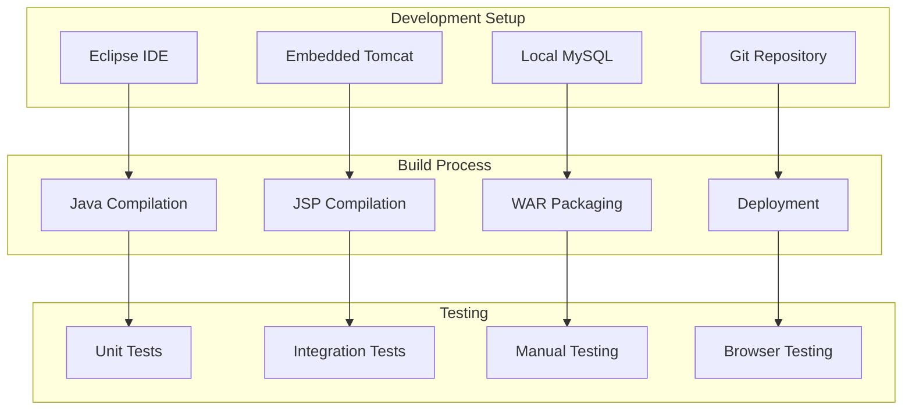

### Production Environment

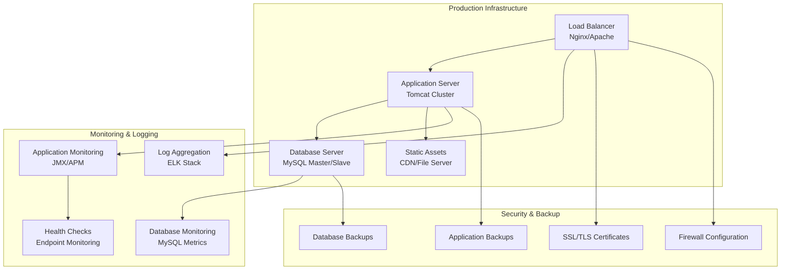

## Technology Integration

### Framework Integration

The application is designed for easy integration with modern frameworks:

1. **Spring Framework Integration:**
   - Replace manual servlet configuration with Spring MVC
   - Implement dependency injection for DAO classes
   - Add Spring Security for authentication
   - Utilize Spring Boot for simplified configuration

2. **ORM Integration:**
   - Replace JDBC with Hibernate or JPA
   - Implement entity relationships and lazy loading
   - Add connection pooling and caching
   - Utilize query optimization features

3. **Frontend Framework Integration:**
   - Replace JSP with REST API endpoints
   - Implement Single Page Application (SPA) with React/Angular
   - Add real-time updates with WebSockets
   - Implement progressive web app features

## Migration and Evolution Path

### Phase 1: Current Architecture (Completed)
- Servlet-based MVC architecture
- JSP views with embedded Java
- JDBC data access layer
- Session-based state management

### Phase 2: Framework Integration (Future)
- Spring Framework integration
- RESTful API development
- Modern frontend framework
- Improved security and validation

### Phase 3: Microservices Architecture (Future)
- Service decomposition
- API Gateway implementation
- Distributed caching
- Container orchestration

### Phase 4: Cloud-Native Architecture (Future)
- Cloud platform migration
- Serverless functions
- Managed database services
- Auto-scaling and load balancing

---

**Document Status:** Approved  
**Next Review Date:** Q2 2025  
**Architecture Review Board:** Development Team, Technical Leadership