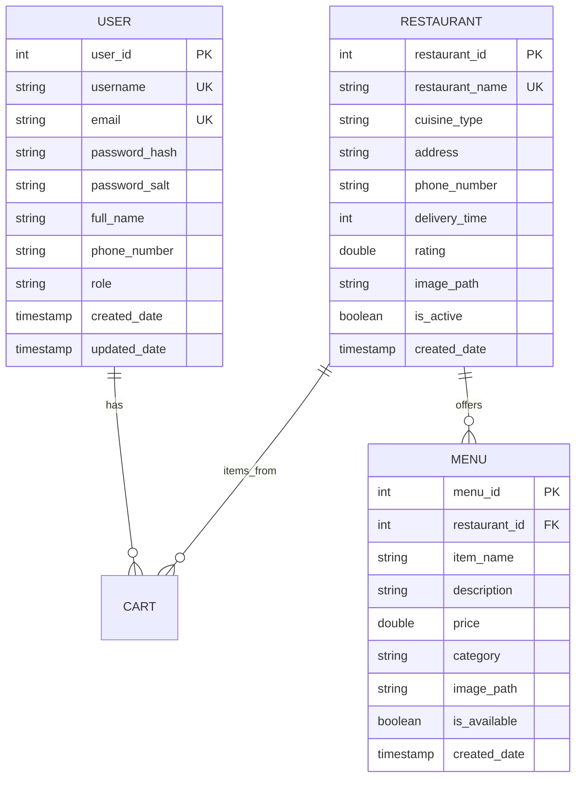

# Database Schema Documentation
## JEE Food App - MySQL Database Design

**Version:** 1.0  
**Date:** December 2024  
**Database Team:** Development Team  

---

## Overview

The JEE Food App uses a MySQL database named `instant_food` to store all application data. The database follows a normalized design with proper relationships, constraints, and indexes to ensure data integrity and optimal performance.

### Database Information
- **Database Name:** `instant_food`
- **Database Engine:** InnoDB
- **Character Set:** utf8mb4
- **Collation:** utf8mb4_unicode_ci
- **MySQL Version:** 8.0+

## Entity Relationship Diagram


    
    CART {
        int cart_id PK
        int user_id FK
        int restaurant_id FK
        double cart_total
        timestamp created_date
        timestamp updated_date
    }
    
    CART_ITEM {
        int cart_item_id PK
        int cart_id FK
        int menu_id FK
        int quantity
        double item_total
        timestamp added_date
    }
    
    ORDERS {
        int order_id PK
        int user_id FK
        int restaurant_id FK
        double total_amount
        string status
        string payment_mode
        string delivery_address
        timestamp created_date
        timestamp updated_date
    }
    
    ORDER_ITEM {
        int order_item_id PK
        int order_id FK
        int menu_id FK
        string item_name
        double item_price
        int quantity
        double item_total
    }
    
    ADDRESS {
        int address_id PK
        int user_id FK
        string address_line
        string city
        string state
        string postal_code
        boolean is_default
        timestamp created_date
    }
    
    REVIEW {
        int review_id PK
        int user_id FK
        int restaurant_id FK
        int rating
        string comment
        timestamp created_date
    }
    
    USER ||--o{ ORDERS : "places"
    USER ||--o{ ADDRESS : "has"
    USER ||--o{ REVIEW : "writes"
    
    CART ||--o{ CART_ITEM : "contains"
    ORDERS ||--o{ ORDER_ITEM : "contains"
    RESTAURANT ||--o{ ORDERS : "receives"
    RESTAURANT ||--o{ REVIEW : "receives"
    
    MENU ||--o{ CART_ITEM : "added_to"
    MENU ||--o{ ORDER_ITEM : "ordered_as"
```

## Table Definitions

### 1. user Table

**Purpose:** Store user account information and authentication data

```sql
CREATE TABLE user (
    user_id INT PRIMARY KEY AUTO_INCREMENT,
    username VARCHAR(50) NOT NULL UNIQUE,
    email VARCHAR(100) NOT NULL UNIQUE,
    password_hash VARCHAR(255) NOT NULL,
    password_salt VARCHAR(255) NOT NULL,
    full_name VARCHAR(100),
    phone_number VARCHAR(15),
    role VARCHAR(20) NOT NULL DEFAULT 'CUSTOMER',
    created_date TIMESTAMP DEFAULT CURRENT_TIMESTAMP,
    updated_date TIMESTAMP DEFAULT CURRENT_TIMESTAMP ON UPDATE CURRENT_TIMESTAMP,
    
    INDEX idx_user_email (email),
    INDEX idx_user_username (username),
    INDEX idx_user_role (role)
);
```

**Column Details:**
- `user_id`: Auto-incrementing primary key
- `username`: Unique username, 3-50 characters
- `email`: Unique email address for login
- `password_hash`: SHA-256 hashed password
- `password_salt`: Random salt for password security
- `full_name`: Optional full display name
- `phone_number`: Contact number, format validation in application
- `role`: User role (CUSTOMER, ADMIN, RESTAURANT_OWNER)
- `created_date`: Account creation timestamp
- `updated_date`: Last modification timestamp

**Constraints:**
- Email must be unique across all users
- Username must be unique across all users
- Password hash and salt are required fields
- Role defaults to 'CUSTOMER' if not specified

**Sample Data:**
```sql
INSERT INTO user (username, email, password_hash, password_salt, full_name, phone_number) 
VALUES 
('john_doe', 'john@example.com', 'hashed_password', 'random_salt', 'John Doe', '1234567890'),
('jane_smith', 'jane@example.com', 'hashed_password', 'random_salt', 'Jane Smith', '0987654321');
```

### 2. restaurant Table

**Purpose:** Store restaurant information and business details

```sql
CREATE TABLE restaurant (
    restaurant_id INT PRIMARY KEY AUTO_INCREMENT,
    restaurant_name VARCHAR(100) NOT NULL UNIQUE,
    cuisine_type VARCHAR(50) NOT NULL,
    address TEXT NOT NULL,
    phone_number VARCHAR(15),
    delivery_time INT NOT NULL DEFAULT 30,
    rating DECIMAL(3,2) DEFAULT 0.00,
    image_path VARCHAR(255),
    is_active BOOLEAN DEFAULT TRUE,
    created_date TIMESTAMP DEFAULT CURRENT_TIMESTAMP,
    
    INDEX idx_restaurant_name (restaurant_name),
    INDEX idx_restaurant_cuisine (cuisine_type),
    INDEX idx_restaurant_rating (rating),
    INDEX idx_restaurant_active (is_active)
);
```
**Column Details:**
- `restaurant_id`: Auto-incrementing primary key
- `restaurant_name`: Unique restaurant name
- `cuisine_type`: Type of cuisine (Italian, Chinese, Indian, etc.)
- `address`: Full restaurant address
- `phone_number`: Restaurant contact number
- `delivery_time`: Average delivery time in minutes
- `rating`: Average rating out of 5.00
- `image_path`: Path to restaurant image file
- `is_active`: Whether restaurant is currently operating
- `created_date`: Restaurant registration timestamp

**Business Rules:**
- Restaurant names must be unique
- Delivery time must be positive integer
- Rating range: 0.00 to 5.00
- Only active restaurants shown to customers

**Sample Data:**
```sql
INSERT INTO restaurant (restaurant_name, cuisine_type, address, phone_number, delivery_time, rating, image_path) 
VALUES 
('Pizza Palace', 'Italian', '123 Main St, Springfield', '555-0101', 30, 4.5, '/images/pizza_palace.jpg'),
('Dragon Garden', 'Chinese', '456 Oak Ave, Springfield', '555-0102', 25, 4.2, '/images/dragon_garden.jpg'),
('Spice Route', 'Indian', '789 Pine Rd, Springfield', '555-0103', 35, 4.7, '/images/spice_route.jpg');
```

### 3. menu Table

**Purpose:** Store menu items for each restaurant

```sql
CREATE TABLE menu (
    menu_id INT PRIMARY KEY AUTO_INCREMENT,
    restaurant_id INT NOT NULL,
    item_name VARCHAR(100) NOT NULL,
    description TEXT,
    price DECIMAL(10,2) NOT NULL,
    category VARCHAR(50),
    image_path VARCHAR(255),
    is_available BOOLEAN DEFAULT TRUE,
    created_date TIMESTAMP DEFAULT CURRENT_TIMESTAMP,
    
    FOREIGN KEY (restaurant_id) REFERENCES restaurant(restaurant_id) ON DELETE CASCADE,
    INDEX idx_menu_restaurant (restaurant_id),
    INDEX idx_menu_category (category),
    INDEX idx_menu_available (is_available),
    INDEX idx_menu_name (item_name)
);
```

**Column Details:**
- `menu_id`: Auto-incrementing primary key
- `restaurant_id`: Foreign key to restaurant table
- `item_name`: Name of the menu item
- `description`: Detailed item description
- `price`: Item price in decimal format
- `category`: Item category (Appetizers, Main Course, Desserts, etc.)
- `image_path`: Path to item image file
- `is_available`: Whether item is currently available
- `created_date`: Item creation timestamp

**Business Rules:**
- Each item belongs to exactly one restaurant
- Price must be positive value
- Only available items shown to customers
- Items deleted when restaurant is deleted (CASCADE)
**Sample Data:**
```sql
INSERT INTO menu (restaurant_id, item_name, description, price, category, image_path) 
VALUES 
(1, 'Margherita Pizza', 'Classic pizza with tomato sauce, mozzarella and basil', 12.99, 'Main Course', '/images/margherita.jpg'),
(1, 'Caesar Salad', 'Fresh romaine lettuce with caesar dressing and croutons', 8.99, 'Appetizers', '/images/caesar.jpg'),
(2, 'Sweet and Sour Chicken', 'Crispy chicken with sweet and sour sauce', 14.99, 'Main Course', '/images/sweet_sour.jpg'),
(3, 'Butter Chicken', 'Tender chicken in creamy tomato curry sauce', 16.99, 'Main Course', '/images/butter_chicken.jpg');
```

### 4. cart Table

**Purpose:** Store active shopping carts (primarily session-based in current implementation)

```sql
CREATE TABLE cart (
    cart_id INT PRIMARY KEY AUTO_INCREMENT,
    user_id INT NOT NULL,
    restaurant_id INT NOT NULL,
    cart_total DECIMAL(10,2) DEFAULT 0.00,
    created_date TIMESTAMP DEFAULT CURRENT_TIMESTAMP,
    updated_date TIMESTAMP DEFAULT CURRENT_TIMESTAMP ON UPDATE CURRENT_TIMESTAMP,
    
    FOREIGN KEY (user_id) REFERENCES user(user_id) ON DELETE CASCADE,
    FOREIGN KEY (restaurant_id) REFERENCES restaurant(restaurant_id) ON DELETE CASCADE,
    INDEX idx_cart_user (user_id),
    INDEX idx_cart_restaurant (restaurant_id),
    UNIQUE KEY uk_cart_user_restaurant (user_id, restaurant_id)
);
```

**Column Details:**
- `cart_id`: Auto-incrementing primary key
- `user_id`: Foreign key to user table
- `restaurant_id`: Foreign key to restaurant table
- `cart_total`: Calculated total of all cart items
- `created_date`: Cart creation timestamp
- `updated_date`: Last modification timestamp

**Business Rules:**
- One active cart per user per restaurant
- Cart total automatically calculated from cart items
- Cart deleted when user or restaurant is deleted
- Currently used primarily for database persistence (session-based in app)

### 5. cart_item Table

**Purpose:** Store individual items within shopping carts

```sql
CREATE TABLE cart_item (
    cart_item_id INT PRIMARY KEY AUTO_INCREMENT,
    cart_id INT NOT NULL,
    menu_id INT NOT NULL,
    quantity INT NOT NULL DEFAULT 1,
    item_total DECIMAL(10,2) NOT NULL,
    added_date TIMESTAMP DEFAULT CURRENT_TIMESTAMP,
    
    FOREIGN KEY (cart_id) REFERENCES cart(cart_id) ON DELETE CASCADE,
    FOREIGN KEY (menu_id) REFERENCES menu(menu_id) ON DELETE CASCADE,
    INDEX idx_cart_item_cart (cart_id),
    INDEX idx_cart_item_menu (menu_id),
    UNIQUE KEY uk_cart_item_menu (cart_id, menu_id)
);
```

**Column Details:**
- `cart_item_id`: Auto-incrementing primary key
- `cart_id`: Foreign key to cart table
- `menu_id`: Foreign key to menu table
- `quantity`: Number of items (1-99)
- `item_total`: Calculated total (quantity × item price)
- `added_date`: When item was added to cart

**Business Rules:**
- Each menu item can appear only once per cart (quantity updated instead)
- Quantity must be positive integer
- Item total = quantity × menu item price
- Items deleted when cart or menu item is deleted
### 6. orders Table

**Purpose:** Store completed customer orders

```sql
CREATE TABLE orders (
    order_id INT PRIMARY KEY AUTO_INCREMENT,
    user_id INT NOT NULL,
    restaurant_id INT NOT NULL,
    total_amount DECIMAL(10,2) NOT NULL,
    status VARCHAR(50) NOT NULL DEFAULT 'Confirmed',
    payment_mode VARCHAR(50) NOT NULL,
    delivery_address TEXT NOT NULL,
    created_date TIMESTAMP DEFAULT CURRENT_TIMESTAMP,
    updated_date TIMESTAMP DEFAULT CURRENT_TIMESTAMP ON UPDATE CURRENT_TIMESTAMP,
    
    FOREIGN KEY (user_id) REFERENCES user(user_id) ON DELETE RESTRICT,
    FOREIGN KEY (restaurant_id) REFERENCES restaurant(restaurant_id) ON DELETE RESTRICT,
    INDEX idx_orders_user (user_id),
    INDEX idx_orders_restaurant (restaurant_id),
    INDEX idx_orders_status (status),
    INDEX idx_orders_date (created_date),
    INDEX idx_orders_user_date (user_id, created_date)
);
```

**Column Details:**
- `order_id`: Auto-incrementing primary key
- `user_id`: Foreign key to user table
- `restaurant_id`: Foreign key to restaurant table
- `total_amount`: Final order total (including fees and taxes)
- `status`: Order status (Confirmed, Pending, Preparing, Out for Delivery, Delivered, Cancelled)
- `payment_mode`: Payment method (Credit Card, Debit Card, UPI, Cash on Delivery)
- `delivery_address`: Full delivery address provided by customer
- `created_date`: Order placement timestamp
- `updated_date`: Last status update timestamp

**Business Rules:**
- Orders cannot be deleted (RESTRICT on foreign keys)
- Total amount includes items + delivery fee + taxes
- Status progression: Confirmed → Pending → Preparing → Out for Delivery → Delivered
- Payment mode must be one of the supported methods

**Status Values:**
- `Confirmed`: Order placed and payment confirmed
- `Pending`: Order received by restaurant
- `Preparing`: Restaurant is preparing the order
- `Out for Delivery`: Order dispatched for delivery
- `Delivered`: Order successfully delivered
- `Cancelled`: Order cancelled by customer or restaurant

**Sample Data:**
```sql
INSERT INTO orders (user_id, restaurant_id, total_amount, status, payment_mode, delivery_address) 
VALUES 
(1, 1, 27.48, 'Confirmed', 'Credit Card', '123 Customer Street, Apt 4B, Springfield, IL 62701'),
(2, 2, 19.74, 'Delivered', 'Cash on Delivery', '456 Oak Avenue, Springfield, IL 62702');
```

### 7. order_item Table

**Purpose:** Store individual items within completed orders

```sql
CREATE TABLE order_item (
    order_item_id INT PRIMARY KEY AUTO_INCREMENT,
    order_id INT NOT NULL,
    menu_id INT NOT NULL,
    item_name VARCHAR(100) NOT NULL,
    item_price DECIMAL(10,2) NOT NULL,
    quantity INT NOT NULL,
    item_total DECIMAL(10,2) NOT NULL,
    
    FOREIGN KEY (order_id) REFERENCES orders(order_id) ON DELETE RESTRICT,
    FOREIGN KEY (menu_id) REFERENCES menu(menu_id) ON DELETE RESTRICT,
    INDEX idx_order_item_order (order_id),
    INDEX idx_order_item_menu (menu_id)
);
```

**Column Details:**
- `order_item_id`: Auto-incrementing primary key
- `order_id`: Foreign key to orders table
- `menu_id`: Foreign key to menu table (for reference)
- `item_name`: Snapshot of item name at time of order
- `item_price`: Snapshot of item price at time of order
- `quantity`: Number of items ordered
- `item_total`: Calculated total (quantity × item_price)

**Business Rules:**
- Stores snapshot of menu item details at time of order
- Prevents data loss if menu items are modified later
- Order items cannot be deleted (RESTRICT on foreign keys)
- Item total must equal quantity × item_price
### 8. address Table

**Purpose:** Store multiple delivery addresses for users

```sql
CREATE TABLE address (
    address_id INT PRIMARY KEY AUTO_INCREMENT,
    user_id INT NOT NULL,
    address_line TEXT NOT NULL,
    city VARCHAR(100) NOT NULL,
    state VARCHAR(100) NOT NULL,
    postal_code VARCHAR(20) NOT NULL,
    is_default BOOLEAN DEFAULT FALSE,
    created_date TIMESTAMP DEFAULT CURRENT_TIMESTAMP,
    
    FOREIGN KEY (user_id) REFERENCES user(user_id) ON DELETE CASCADE,
    INDEX idx_address_user (user_id),
    INDEX idx_address_default (user_id, is_default)
);
```

**Column Details:**
- `address_id`: Auto-incrementing primary key
- `user_id`: Foreign key to user table
- `address_line`: Street address and apartment/unit number
- `city`: City name
- `state`: State or province
- `postal_code`: ZIP or postal code
- `is_default`: Whether this is the user's default address
- `created_date`: Address creation timestamp

**Business Rules:**
- Users can have multiple saved addresses
- Only one default address per user
- Addresses deleted when user is deleted
- Used for quick address selection during checkout

### 9. review Table

**Purpose:** Store customer reviews and ratings for restaurants

```sql
CREATE TABLE review (
    review_id INT PRIMARY KEY AUTO_INCREMENT,
    user_id INT NOT NULL,
    restaurant_id INT NOT NULL,
    rating INT NOT NULL CHECK (rating >= 1 AND rating <= 5),
    comment TEXT,
    created_date TIMESTAMP DEFAULT CURRENT_TIMESTAMP,
    
    FOREIGN KEY (user_id) REFERENCES user(user_id) ON DELETE CASCADE,
    FOREIGN KEY (restaurant_id) REFERENCES restaurant(restaurant_id) ON DELETE CASCADE,
    INDEX idx_review_user (user_id),
    INDEX idx_review_restaurant (restaurant_id),
    INDEX idx_review_rating (rating),
    UNIQUE KEY uk_review_user_restaurant (user_id, restaurant_id)
);
```

**Column Details:**
- `review_id`: Auto-incrementing primary key
- `user_id`: Foreign key to user table
- `restaurant_id`: Foreign key to restaurant table
- `rating`: Numeric rating from 1 to 5 stars
- `comment`: Optional text review
- `created_date`: Review submission timestamp

**Business Rules:**
- One review per user per restaurant
- Rating must be between 1 and 5 (inclusive)
- Comment is optional
- Reviews deleted when user or restaurant is deleted
- Used to calculate restaurant average rating

## Database Relationships

### Primary Relationships

1. **User → Cart (1:Many)**
   - Each user can have multiple carts (one per restaurant)
   - Currently implemented as session-based, minimal database usage

2. **User → Orders (1:Many)**
   - Each user can place multiple orders
   - Orders are permanent records of completed purchases

3. **Restaurant → Menu (1:Many)**
   - Each restaurant has multiple menu items
   - Menu items belong to exactly one restaurant

4. **Cart → CartItem (1:Many)**
   - Each cart contains multiple cart items
   - Cart items belong to exactly one cart

5. **Order → OrderItem (1:Many)**
   - Each order contains multiple order items
   - Order items belong to exactly one order

### Secondary Relationships

6. **User → Address (1:Many)**
   - Users can save multiple delivery addresses
   - Addresses belong to exactly one user

7. **User → Review (1:Many)**
   - Users can review multiple restaurants
   - Each review belongs to exactly one user

8. **Restaurant → Review (1:Many)**
   - Restaurants can receive multiple reviews
   - Each review is for exactly one restaurant
## Indexes and Performance Optimization

### Primary Key Indexes
All tables have auto-incrementing primary keys which are automatically indexed by MySQL.

### Foreign Key Indexes
```sql
-- Menu table indexes
CREATE INDEX idx_menu_restaurant ON menu(restaurant_id);

-- Cart table indexes  
CREATE INDEX idx_cart_user ON cart(user_id);
CREATE INDEX idx_cart_restaurant ON cart(restaurant_id);

-- Cart item indexes
CREATE INDEX idx_cart_item_cart ON cart_item(cart_id);
CREATE INDEX idx_cart_item_menu ON cart_item(menu_id);

-- Order table indexes
CREATE INDEX idx_orders_user ON orders(user_id);
CREATE INDEX idx_orders_restaurant ON orders(restaurant_id);

-- Order item indexes
CREATE INDEX idx_order_item_order ON order_item(order_id);
CREATE INDEX idx_order_item_menu ON order_item(menu_id);

-- Address table indexes
CREATE INDEX idx_address_user ON address(user_id);

-- Review table indexes
CREATE INDEX idx_review_user ON review(user_id);
CREATE INDEX idx_review_restaurant ON review(restaurant_id);
```

### Search Optimization Indexes
```sql
-- User search indexes
CREATE INDEX idx_user_email ON user(email);
CREATE INDEX idx_user_username ON user(username);

-- Restaurant search indexes
CREATE INDEX idx_restaurant_name ON restaurant(restaurant_name);
CREATE INDEX idx_restaurant_cuisine ON restaurant(cuisine_type);
CREATE INDEX idx_restaurant_rating ON restaurant(rating);
CREATE INDEX idx_restaurant_active ON restaurant(is_active);

-- Menu search indexes
CREATE INDEX idx_menu_name ON menu(item_name);
CREATE INDEX idx_menu_category ON menu(category);
CREATE INDEX idx_menu_available ON menu(is_available);

-- Order management indexes
CREATE INDEX idx_orders_status ON orders(status);
CREATE INDEX idx_orders_date ON orders(created_date);

-- Review indexes
CREATE INDEX idx_review_rating ON review(rating);
```

### Composite Indexes for Complex Queries
```sql
-- User cart management
CREATE UNIQUE INDEX uk_cart_user_restaurant ON cart(user_id, restaurant_id);

-- Cart item uniqueness
CREATE UNIQUE INDEX uk_cart_item_menu ON cart_item(cart_id, menu_id);

-- Review uniqueness
CREATE UNIQUE INDEX uk_review_user_restaurant ON review(user_id, restaurant_id);

-- Order history queries
CREATE INDEX idx_orders_user_date ON orders(user_id, created_date);

-- Menu availability by restaurant
CREATE INDEX idx_menu_restaurant_available ON menu(restaurant_id, is_available);

-- Default address lookup
CREATE INDEX idx_address_default ON address(user_id, is_default);
```

## Data Validation and Constraints

### Check Constraints
```sql
-- Review rating constraint
ALTER TABLE review ADD CONSTRAINT chk_review_rating 
CHECK (rating >= 1 AND rating <= 5);

-- Restaurant rating constraint  
ALTER TABLE restaurant ADD CONSTRAINT chk_restaurant_rating 
CHECK (rating >= 0.00 AND rating <= 5.00);

-- Quantity constraints
ALTER TABLE cart_item ADD CONSTRAINT chk_cart_item_quantity 
CHECK (quantity > 0 AND quantity <= 99);

ALTER TABLE order_item ADD CONSTRAINT chk_order_item_quantity 
CHECK (quantity > 0);

-- Price constraints
ALTER TABLE menu ADD CONSTRAINT chk_menu_price 
CHECK (price >= 0.00);

ALTER TABLE orders ADD CONSTRAINT chk_orders_total 
CHECK (total_amount >= 0.00);

-- Delivery time constraint
ALTER TABLE restaurant ADD CONSTRAINT chk_restaurant_delivery 
CHECK (delivery_time > 0);
```
### Unique Constraints
```sql
-- User uniqueness
ALTER TABLE user ADD CONSTRAINT uk_user_username UNIQUE (username);
ALTER TABLE user ADD CONSTRAINT uk_user_email UNIQUE (email);

-- Restaurant uniqueness
ALTER TABLE restaurant ADD CONSTRAINT uk_restaurant_name UNIQUE (restaurant_name);

-- Cart uniqueness (one cart per user per restaurant)
ALTER TABLE cart ADD CONSTRAINT uk_cart_user_restaurant UNIQUE (user_id, restaurant_id);

-- Cart item uniqueness (one entry per menu item per cart)
ALTER TABLE cart_item ADD CONSTRAINT uk_cart_item_menu UNIQUE (cart_id, menu_id);

-- Review uniqueness (one review per user per restaurant)
ALTER TABLE review ADD CONSTRAINT uk_review_user_restaurant UNIQUE (user_id, restaurant_id);
```

## Database Setup Scripts

### Complete Database Creation Script
```sql
-- Create database
CREATE DATABASE IF NOT EXISTS instant_food 
CHARACTER SET utf8mb4 
COLLATE utf8mb4_unicode_ci;

USE instant_food;

-- Create user table
CREATE TABLE user (
    user_id INT PRIMARY KEY AUTO_INCREMENT,
    username VARCHAR(50) NOT NULL UNIQUE,
    email VARCHAR(100) NOT NULL UNIQUE,
    password_hash VARCHAR(255) NOT NULL,
    password_salt VARCHAR(255) NOT NULL,
    full_name VARCHAR(100),
    phone_number VARCHAR(15),
    role VARCHAR(20) NOT NULL DEFAULT 'CUSTOMER',
    created_date TIMESTAMP DEFAULT CURRENT_TIMESTAMP,
    updated_date TIMESTAMP DEFAULT CURRENT_TIMESTAMP ON UPDATE CURRENT_TIMESTAMP
);

-- Create restaurant table
CREATE TABLE restaurant (
    restaurant_id INT PRIMARY KEY AUTO_INCREMENT,
    restaurant_name VARCHAR(100) NOT NULL UNIQUE,
    cuisine_type VARCHAR(50) NOT NULL,
    address TEXT NOT NULL,
    phone_number VARCHAR(15),
    delivery_time INT NOT NULL DEFAULT 30,
    rating DECIMAL(3,2) DEFAULT 0.00,
    image_path VARCHAR(255),
    is_active BOOLEAN DEFAULT TRUE,
    created_date TIMESTAMP DEFAULT CURRENT_TIMESTAMP
);

-- Create menu table
CREATE TABLE menu (
    menu_id INT PRIMARY KEY AUTO_INCREMENT,
    restaurant_id INT NOT NULL,
    item_name VARCHAR(100) NOT NULL,
    description TEXT,
    price DECIMAL(10,2) NOT NULL,
    category VARCHAR(50),
    image_path VARCHAR(255),
    is_available BOOLEAN DEFAULT TRUE,
    created_date TIMESTAMP DEFAULT CURRENT_TIMESTAMP,
    FOREIGN KEY (restaurant_id) REFERENCES restaurant(restaurant_id) ON DELETE CASCADE
);

-- Create cart table
CREATE TABLE cart (
    cart_id INT PRIMARY KEY AUTO_INCREMENT,
    user_id INT NOT NULL,
    restaurant_id INT NOT NULL,
    cart_total DECIMAL(10,2) DEFAULT 0.00,
    created_date TIMESTAMP DEFAULT CURRENT_TIMESTAMP,
    updated_date TIMESTAMP DEFAULT CURRENT_TIMESTAMP ON UPDATE CURRENT_TIMESTAMP,
    FOREIGN KEY (user_id) REFERENCES user(user_id) ON DELETE CASCADE,
    FOREIGN KEY (restaurant_id) REFERENCES restaurant(restaurant_id) ON DELETE CASCADE,
    UNIQUE KEY uk_cart_user_restaurant (user_id, restaurant_id)
);

-- Create cart_item table
CREATE TABLE cart_item (
    cart_item_id INT PRIMARY KEY AUTO_INCREMENT,
    cart_id INT NOT NULL,
    menu_id INT NOT NULL,
    quantity INT NOT NULL DEFAULT 1,
    item_total DECIMAL(10,2) NOT NULL,
    added_date TIMESTAMP DEFAULT CURRENT_TIMESTAMP,
    FOREIGN KEY (cart_id) REFERENCES cart(cart_id) ON DELETE CASCADE,
    FOREIGN KEY (menu_id) REFERENCES menu(menu_id) ON DELETE CASCADE,
    UNIQUE KEY uk_cart_item_menu (cart_id, menu_id)
);
```
-- Create orders table
CREATE TABLE orders (
    order_id INT PRIMARY KEY AUTO_INCREMENT,
    user_id INT NOT NULL,
    restaurant_id INT NOT NULL,
    total_amount DECIMAL(10,2) NOT NULL,
    status VARCHAR(50) NOT NULL DEFAULT 'Confirmed',
    payment_mode VARCHAR(50) NOT NULL,
    delivery_address TEXT NOT NULL,
    created_date TIMESTAMP DEFAULT CURRENT_TIMESTAMP,
    updated_date TIMESTAMP DEFAULT CURRENT_TIMESTAMP ON UPDATE CURRENT_TIMESTAMP,
    FOREIGN KEY (user_id) REFERENCES user(user_id) ON DELETE RESTRICT,
    FOREIGN KEY (restaurant_id) REFERENCES restaurant(restaurant_id) ON DELETE RESTRICT
);

-- Create order_item table
CREATE TABLE order_item (
    order_item_id INT PRIMARY KEY AUTO_INCREMENT,
    order_id INT NOT NULL,
    menu_id INT NOT NULL,
    item_name VARCHAR(100) NOT NULL,
    item_price DECIMAL(10,2) NOT NULL,
    quantity INT NOT NULL,
    item_total DECIMAL(10,2) NOT NULL,
    FOREIGN KEY (order_id) REFERENCES orders(order_id) ON DELETE RESTRICT,
    FOREIGN KEY (menu_id) REFERENCES menu(menu_id) ON DELETE RESTRICT
);

-- Create address table
CREATE TABLE address (
    address_id INT PRIMARY KEY AUTO_INCREMENT,
    user_id INT NOT NULL,
    address_line TEXT NOT NULL,
    city VARCHAR(100) NOT NULL,
    state VARCHAR(100) NOT NULL,
    postal_code VARCHAR(20) NOT NULL,
    is_default BOOLEAN DEFAULT FALSE,
    created_date TIMESTAMP DEFAULT CURRENT_TIMESTAMP,
    FOREIGN KEY (user_id) REFERENCES user(user_id) ON DELETE CASCADE
);

-- Create review table
CREATE TABLE review (
    review_id INT PRIMARY KEY AUTO_INCREMENT,
    user_id INT NOT NULL,
    restaurant_id INT NOT NULL,
    rating INT NOT NULL CHECK (rating >= 1 AND rating <= 5),
    comment TEXT,
    created_date TIMESTAMP DEFAULT CURRENT_TIMESTAMP,
    FOREIGN KEY (user_id) REFERENCES user(user_id) ON DELETE CASCADE,
    FOREIGN KEY (restaurant_id) REFERENCES restaurant(restaurant_id) ON DELETE CASCADE,
    UNIQUE KEY uk_review_user_restaurant (user_id, restaurant_id)
);
```

### Sample Data Insertion Script
```sql
-- Insert sample users
INSERT INTO user (username, email, password_hash, password_salt, full_name, phone_number) VALUES
('john_doe', 'john@example.com', 'hashed_password_1', 'salt_1', 'John Doe', '1234567890'),
('jane_smith', 'jane@example.com', 'hashed_password_2', 'salt_2', 'Jane Smith', '0987654321'),
('admin_user', 'admin@foodapp.com', 'hashed_password_3', 'salt_3', 'System Admin', '5555555555');

-- Insert sample restaurants
INSERT INTO restaurant (restaurant_name, cuisine_type, address, phone_number, delivery_time, rating, image_path) VALUES
('Pizza Palace', 'Italian', '123 Main Street, Downtown Springfield', '555-0101', 30, 4.5, '/images/restaurants/pizza_palace.jpg'),
('Dragon Garden', 'Chinese', '456 Oak Avenue, Chinatown Springfield', '555-0102', 25, 4.2, '/images/restaurants/dragon_garden.jpg'),
('Spice Route', 'Indian', '789 Pine Road, Little India Springfield', '555-0103', 35, 4.7, '/images/restaurants/spice_route.jpg'),
('Burger Barn', 'American', '321 Elm Street, Springfield Mall', '555-0104', 20, 4.0, '/images/restaurants/burger_barn.jpg');
```
-- Insert sample menu items
INSERT INTO menu (restaurant_id, item_name, description, price, category, image_path) VALUES
-- Pizza Palace items
(1, 'Margherita Pizza', 'Classic pizza with tomato sauce, fresh mozzarella, and basil', 12.99, 'Pizza', '/images/menu/margherita_pizza.jpg'),
(1, 'Pepperoni Pizza', 'Traditional pepperoni pizza with mozzarella cheese', 14.99, 'Pizza', '/images/menu/pepperoni_pizza.jpg'),
(1, 'Caesar Salad', 'Fresh romaine lettuce with caesar dressing, croutons, and parmesan', 8.99, 'Salads', '/images/menu/caesar_salad.jpg'),
(1, 'Garlic Bread', 'Crispy bread with garlic butter and herbs', 5.99, 'Appetizers', '/images/menu/garlic_bread.jpg'),

-- Dragon Garden items  
(2, 'Sweet and Sour Chicken', 'Crispy chicken pieces with sweet and sour sauce', 14.99, 'Main Course', '/images/menu/sweet_sour_chicken.jpg'),
(2, 'Beef Broccoli', 'Tender beef with fresh broccoli in savory sauce', 16.99, 'Main Course', '/images/menu/beef_broccoli.jpg'),
(2, 'Fried Rice', 'Wok-fried rice with vegetables and choice of protein', 11.99, 'Rice & Noodles', '/images/menu/fried_rice.jpg'),
(2, 'Spring Rolls', 'Crispy vegetable spring rolls with dipping sauce', 7.99, 'Appetizers', '/images/menu/spring_rolls.jpg'),

-- Spice Route items
(3, 'Butter Chicken', 'Tender chicken in creamy tomato curry sauce', 16.99, 'Curry', '/images/menu/butter_chicken.jpg'),
(3, 'Lamb Biryani', 'Fragrant basmati rice with spiced lamb and saffron', 19.99, 'Biryani', '/images/menu/lamb_biryani.jpg'),
(3, 'Naan Bread', 'Fresh-baked Indian bread, plain or garlic', 3.99, 'Breads', '/images/menu/naan_bread.jpg'),
(3, 'Samosas', 'Crispy pastries filled with spiced vegetables', 6.99, 'Appetizers', '/images/menu/samosas.jpg'),

-- Burger Barn items
(4, 'Classic Cheeseburger', 'Beef patty with cheese, lettuce, tomato, and pickles', 11.99, 'Burgers', '/images/menu/cheeseburger.jpg'),
(4, 'BBQ Bacon Burger', 'Beef patty with BBQ sauce, bacon, and onion rings', 13.99, 'Burgers', '/images/menu/bbq_bacon_burger.jpg'),
(4, 'French Fries', 'Crispy golden french fries with seasoning', 4.99, 'Sides', '/images/menu/french_fries.jpg'),
(4, 'Milkshake', 'Thick milkshake in vanilla, chocolate, or strawberry', 5.99, 'Beverages', '/images/menu/milkshake.jpg');

-- Insert sample addresses
INSERT INTO address (user_id, address_line, city, state, postal_code, is_default) VALUES
(1, '123 Customer Street, Apt 4B', 'Springfield', 'IL', '62701', TRUE),
(1, '456 Work Plaza, Suite 200', 'Springfield', 'IL', '62702', FALSE),
(2, '789 Oak Avenue, House #12', 'Springfield', 'IL', '62703', TRUE);

-- Insert sample reviews
INSERT INTO review (user_id, restaurant_id, rating, comment) VALUES
(1, 1, 5, 'Amazing pizza! The margherita was perfect and delivered hot.'),
(1, 2, 4, 'Good Chinese food, fast delivery. Sweet and sour chicken was delicious.'),
(2, 1, 4, 'Great pizza place, will order again. Caesar salad was fresh.'),
(2, 3, 5, 'Best Indian food in town! Butter chicken was incredible.');
```

## Maintenance and Optimization

### Regular Maintenance Tasks

1. **Index Optimization**
   ```sql
   -- Analyze table usage
   SHOW TABLE STATUS;
   
   -- Check index usage
   SHOW INDEX FROM table_name;
   
   -- Optimize tables monthly
   OPTIMIZE TABLE user, restaurant, menu, orders, order_item;
   ```

2. **Data Archival**
   ```sql
   -- Archive old orders (older than 2 years)
   CREATE TABLE orders_archive AS 
   SELECT * FROM orders WHERE created_date < DATE_SUB(NOW(), INTERVAL 2 YEAR);
   
   -- Archive old reviews (optional)
   CREATE TABLE reviews_archive AS 
   SELECT * FROM review WHERE created_date < DATE_SUB(NOW(), INTERVAL 1 YEAR);
   ```

3. **Performance Monitoring**
   ```sql
   -- Monitor slow queries
   SHOW VARIABLES LIKE 'slow_query_log';
   SHOW VARIABLES LIKE 'long_query_time';
   
   -- Check table sizes
   SELECT table_name, 
          ROUND(((data_length + index_length) / 1024 / 1024), 2) AS 'Size (MB)'
   FROM information_schema.tables 
   WHERE table_schema = 'instant_food';
   ```

---

**Document Status:** Approved  
**Next Review Date:** Q2 2025  
**Database Team:** Development Team, DBA Team