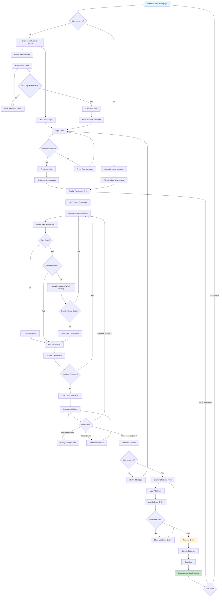
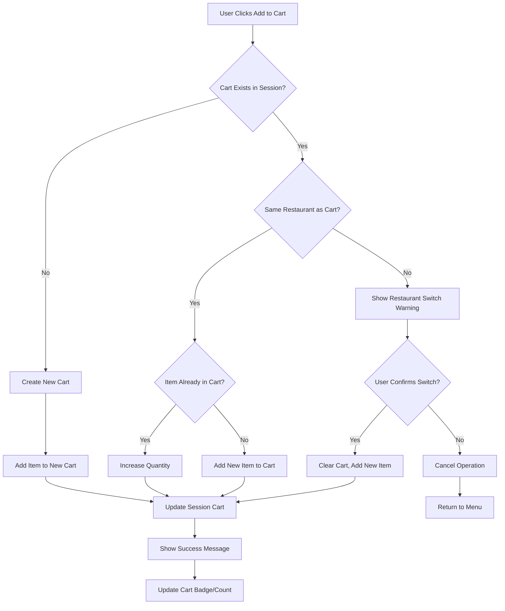
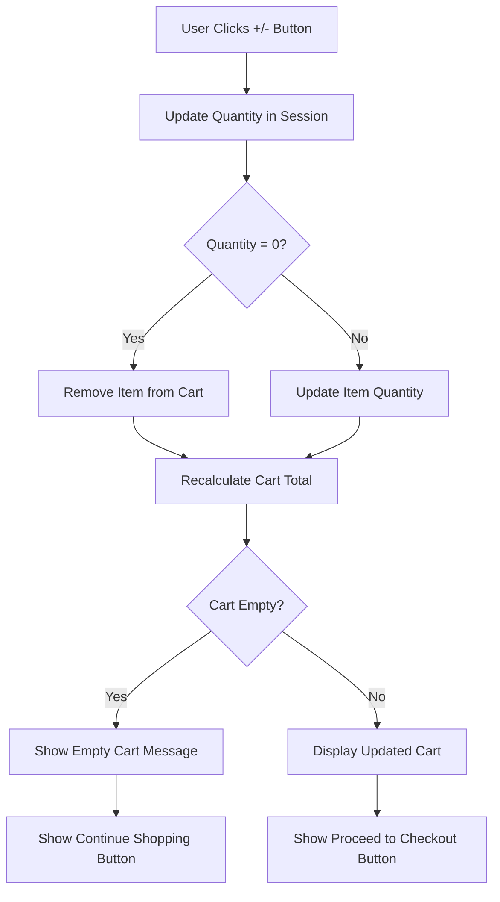
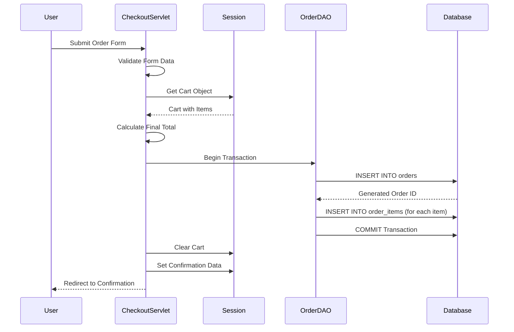

# User Flow Document
## JEE Food App - User Journey and Experience Flows

**Version:** 1.0  
**Date:** December 2024  
**UX Team:** Development Team  

---

## Overview

This document defines the complete user journey through the JEE Food App, from initial landing to order completion. It covers all user interactions, decision points, system responses, and edge cases to ensure a comprehensive understanding of the user experience.

## User Flow Diagram - Complete Journey


## Detailed User Flows

### 1. User Authentication Flow

#### 1.1 New User Registration

**Entry Point:** Homepage or Login page  
**User Goal:** Create a new account to place orders

**Flow Steps:**
1. **Landing:** User arrives at login page or clicks "Register" link
2. **Form Display:** System shows registration form with required fields
3. **Data Entry:** User fills out registration information
4. **Validation:** System validates input data
5. **Account Creation:** If valid, system creates new user account
6. **Confirmation:** User sees success message and login prompt

**Form Fields Required:**
- Username (3-30 characters, alphanumeric)
- Email address (valid format, unique)
- Password (minimum 6 characters)
- Full Name (optional)
- Phone Number (optional)

**Success Criteria:**
- Account created in database with hashed password
- User redirected to login page with success message
- User can immediately log in with new credentials

**Error Scenarios:**
- **Invalid Email:** "Please enter a valid email address"
- **Email Exists:** "An account with this email already exists"
- **Weak Password:** "Password must be at least 6 characters long"
- **Username Taken:** "This username is already taken"

**Technical Implementation:**
```
POST /user?action=register
→ UserServlet validates input
→ Check email/username uniqueness
→ Hash password with salt
→ Insert user record
→ Redirect to login with success message
```

#### 1.2 User Login

**Entry Point:** Homepage, login page, or protected page redirect  
**User Goal:** Access account to browse restaurants and place orders

**Flow Steps:**
1. **Form Display:** System shows login form
2. **Credential Entry:** User enters email and password
3. **Authentication:** System verifies credentials against database
4. **Session Creation:** If valid, system creates user session
5. **Redirect:** User redirected to intended destination

**Success Criteria:**
- User object stored in HTTP session
- User ID stored in session for quick access
- Redirect to restaurants page or originally requested page

**Error Scenarios:**
- **Invalid Credentials:** "Invalid email or password"
- **Account Not Found:** "No account found with this email"
- **Empty Fields:** "Please fill in all required fields"

**Technical Implementation:**
```
POST /user?action=login
→ UserServlet validates credentials
→ Retrieve user from database
→ Verify password hash
→ Create HTTP session
→ Store user object in session
→ Redirect to /RestaurantServlet
```

### 2. Restaurant Discovery Flow

#### 2.1 Browse All Restaurants

**Entry Point:** Homepage "Explore Restaurants" button or direct navigation  
**User Goal:** Discover available restaurants and choose one to order from

**Flow Steps:**
1. **Page Load:** System displays all active restaurants
2. **Restaurant Display:** Each restaurant shows key information
3. **User Selection:** User clicks on preferred restaurant
4. **Menu Navigation:** System displays selected restaurant's menu

**Display Information Per Restaurant:**
- Restaurant name and cuisine type
- Average customer rating (star display)
- Estimated delivery time
- Restaurant image
- "View Menu" button

**Success Criteria:**
- All active restaurants loaded and displayed
- Restaurant information accurate and up-to-date
- Smooth navigation to restaurant menu
- Responsive design on all devices

**Technical Implementation:**
```
GET /RestaurantServlet
→ RestaurantDAO.getAllRestaurants()
→ Filter for is_active = true
→ Sort by rating DESC, name ASC
→ Forward to restaurants.jsp
→ Display restaurant grid
```

#### 2.2 View Restaurant Menu

**Entry Point:** Restaurant selection from restaurant grid  
**User Goal:** Browse menu items and add desired items to cart

**Flow Steps:**
1. **Menu Load:** System displays all available menu items for restaurant
2. **Item Browsing:** User reviews items, descriptions, and prices
3. **Item Selection:** User chooses items and quantities
4. **Add to Cart:** User clicks "Add to Cart" for selected items

**Display Information Per Menu Item:**
- Item name and description
- Price in local currency (₹)
- Item image (if available)
- Category (Appetizers, Main Course, etc.)
- "Add to Cart" button with quantity selector

**Success Criteria:**
- Only available items displayed (is_available = true)
- Accurate pricing and descriptions
- Clear item categorization
- Intuitive add-to-cart functionality

**Technical Implementation:**
```
GET /menu?restaurantId=123
→ MenuDAO.getMenuByRestaurant(restaurantId)
→ RestaurantDAO.getRestaurant(restaurantId)
→ Filter for is_available = true
→ Forward to menu.jsp with data
```
### 3. Shopping Cart Management Flow

#### 3.1 Add Item to Cart

**Entry Point:** Restaurant menu page  
**User Goal:** Add desired menu items to shopping cart

**Flow Steps:**
1. **Item Selection:** User selects menu item and quantity
2. **Cart Check:** System checks if cart exists and restaurant matches
3. **Restaurant Validation:** If different restaurant, system shows warning
4. **Cart Creation/Update:** System creates new cart or updates existing
5. **Confirmation:** User sees updated cart count/total

**Cart Business Rules:**
- **Single Restaurant Rule:** Only items from one restaurant allowed per cart
- **Restaurant Switch:** Adding from different restaurant clears existing cart
- **Quantity Limits:** 1-99 items per menu item
- **Duplicate Items:** Adding existing item increases quantity instead of duplicating

**Decision Points:**



**Success Scenarios:**
- **New Cart:** Item added to fresh cart, session updated
- **Same Restaurant:** Item added or quantity increased
- **Restaurant Switch Confirmed:** Old cart cleared, new item added

**Error Scenarios:**
- **Item Unavailable:** "This item is currently unavailable"
- **Invalid Quantity:** "Please select a quantity between 1 and 99"
- **Session Error:** "Unable to add item. Please try again"

**Technical Implementation:**
```java
POST /cart?action=add&productId=123&quantity=2&restaurantId=456
→ CartServlet validates parameters
→ Check session for existing cart
→ If different restaurant → confirm switch or cancel
→ Update cart object in session
→ Redirect to /cart with success message
```

#### 3.2 View and Modify Cart

**Entry Point:** Cart button in navigation or after adding items  
**User Goal:** Review cart contents, modify quantities, or proceed to checkout

**Flow Steps:**
1. **Cart Display:** System shows all cart items with details
2. **User Review:** User reviews items, quantities, and totals
3. **Modifications:** User updates quantities or removes items
4. **Calculation Update:** System recalculates totals automatically
5. **Next Action:** User continues shopping or proceeds to checkout

**Cart Display Elements:**
- **Item List:** Each item with name, price, quantity, subtotal
- **Quantity Controls:** + and - buttons for each item
- **Remove Buttons:** Option to remove individual items
- **Order Summary:** Subtotal, delivery fee, GST, total amount
- **Action Buttons:** Continue Shopping, Proceed to Checkout

**Quantity Modification Flow:**



**Calculation Logic:**
```
Item Total = Quantity × Item Price
Cart Subtotal = Sum of all Item Totals
Delivery Fee = ₹40.00 (fixed)
GST = Subtotal × 5%
Final Total = Subtotal + Delivery Fee + GST
```

**Technical Implementation:**
```java
POST /cart?action=update&itemId=789&quantity=3
→ CartServlet finds cart in session
→ Update specific cart item quantity
→ Recalculate cart totals
→ Update session cart object
→ Redirect to /cart
```

### 4. Checkout and Order Processing Flow

#### 4.1 Checkout Initialization

**Entry Point:** "Proceed to Checkout" button on cart page  
**User Goal:** Begin the order placement process

**Flow Steps:**
1. **Authentication Check:** System verifies user is logged in
2. **Cart Validation:** System confirms cart exists and has items
3. **Checkout Form:** System displays checkout form with pre-filled data
4. **User Input:** User provides delivery address and payment method

**Pre-requisites:**
- User must be logged in (redirects to login if not)
- Cart must contain at least one item
- All cart items must still be available

**Form Pre-population:**
- User name and email (read-only)
- Previously used addresses (if saved)
- Default payment method (if saved)

**Technical Implementation:**
```java
GET /checkout
→ CheckoutServlet validates user session
→ Validates cart exists and not empty
→ Set request attributes (cart, user)
→ Forward to checkout.jsp
```
#### 4.2 Order Submission and Processing

**Entry Point:** Checkout form submission  
**User Goal:** Complete order placement and receive confirmation

**Flow Steps:**
1. **Form Validation:** System validates all required fields
2. **Payment Processing:** System records payment method choice
3. **Order Creation:** System creates order record in database
4. **Cart Conversion:** System converts cart items to order items
5. **Session Cleanup:** System clears cart from session
6. **Confirmation:** System displays order confirmation page

**Required Form Fields:**
- **Delivery Address:** Full address including apartment/unit (required)
- **Payment Method:** Credit Card, Debit Card, UPI, or Cash on Delivery (required)

**Order Processing Steps:**



**Order Total Calculation:**
```
Cart Items Total: ₹650.00
Delivery Fee: ₹40.00
GST (5%): ₹32.50
Final Total: ₹722.50
```

**Success Criteria:**
- Order record created with unique ID
- All order items saved with correct quantities and prices
- Cart cleared from user session
- User redirected to confirmation page

**Error Scenarios:**
- **Missing Address:** "Please provide a delivery address"
- **No Payment Method:** "Please select a payment method"
- **Database Error:** "Unable to process order. Please try again"
- **Invalid Cart:** "Your cart is empty or invalid"

#### 4.3 Order Confirmation

**Entry Point:** Successful order processing  
**User Goal:** Receive confirmation of successful order placement

**Flow Steps:**
1. **Confirmation Display:** System shows order confirmation details
2. **Order Information:** System displays order ID, total, and delivery info
3. **Next Steps:** System provides options for continued interaction

**Confirmation Information Displayed:**
- **Order ID:** Unique identifier for tracking
- **Order Status:** "Confirmed"
- **Total Amount:** Final amount charged
- **Estimated Delivery:** 30-45 minutes
- **Order Date/Time:** When order was placed
- **Delivery Address:** Where order will be delivered

**User Options:**
- **Order More Food:** Return to restaurant listing
- **Go to Home:** Return to homepage
- **Print Receipt:** Print order confirmation (future feature)

**Technical Implementation:**
```java
// After successful order creation
session.setAttribute("orderConfirmed", true);
session.setAttribute("orderId", generatedOrderId);
session.setAttribute("orderTotal", finalTotal);
response.sendRedirect("orderConfirmation.jsp");
```

## Edge Cases and Error Scenarios

### 1. Session Management Edge Cases

#### 1.1 Session Expiration During Shopping

**Scenario:** User session expires while items are in cart  
**User Impact:** Loss of cart contents  
**System Behavior:**
- Redirect to login page
- Display message: "Your session has expired. Please log in again"
- Cart contents lost (session-based storage limitation)

**Prevention Strategies:**
- Session timeout warning (future enhancement)
- Periodic session refresh during active shopping
- Optional cart persistence in database for logged-in users

#### 1.2 Browser Refresh/Back Button Behavior

**Scenario:** User uses browser back button or refreshes during checkout  
**System Behavior:**
- **During Form Entry:** Preserve form data where possible
- **After Order Submission:** Prevent duplicate order creation
- **On Confirmation Page:** Show appropriate confirmation or redirect

**Implementation:**
- Use POST-Redirect-GET pattern for order submission
- Store confirmation data in session temporarily
- Clear confirmation data after displaying once

### 2. Cart Management Edge Cases

#### 2.1 Menu Item Becomes Unavailable

**Scenario:** Item in cart becomes unavailable before checkout  
**Detection Point:** During checkout process  
**System Behavior:**
1. Validate all cart items availability
2. Remove unavailable items from cart
3. Notify user of removed items
4. Recalculate cart total
5. Allow user to proceed with remaining items

**User Notification:**
"The following items are no longer available and have been removed from your cart: [Item Names]"

#### 2.2 Restaurant Goes Offline

**Scenario:** Restaurant becomes inactive while user has items in cart  
**System Behavior:**
1. Detect restaurant status during checkout
2. Clear entire cart
3. Notify user of restaurant unavailability
4. Redirect to restaurant listing

**User Notification:**
"Sorry, [Restaurant Name] is currently unavailable. Your cart has been cleared."

#### 2.3 Price Changes During Shopping

**Scenario:** Menu item prices change while item is in cart  
**Current Behavior:** Cart retains original price until page refresh  
**Recommended Enhancement:**
1. Check current prices during checkout
2. Show price differences to user
3. Allow user to confirm or cancel order

### 3. Payment and Order Processing Edge Cases

#### 3.1 Database Connection Failure

**Scenario:** Database unavailable during order processing  
**System Behavior:**
1. Display error message to user
2. Preserve cart contents
3. Allow user to retry
4. Log error for system administrators

**User Message:**
"We're experiencing technical difficulties. Please try again in a few moments. Your cart has been saved."

#### 3.2 Partial Order Processing Failure

**Scenario:** Order record created but order items fail to save  
**System Behavior:**
1. Database transaction rollback
2. Preserve cart contents
3. Show error message
4. Allow retry

**Technical Implementation:**
```java
Connection con = null;
try {
    con = DBConnection.getConnection();
    con.setAutoCommit(false);
    
    // Insert order
    insertOrderRecord(con, order);
    
    // Insert order items
    insertOrderItems(con, orderItems);
    
    con.commit();
} catch (SQLException e) {
    if (con != null) con.rollback();
    throw new OrderProcessingException("Order failed", e);
} finally {
    if (con != null) con.close();
}
```

## Mobile User Experience Considerations

### 1. Mobile-First Design

**Key Considerations:**
- Touch-friendly button sizes (minimum 44px)
- Simplified navigation for small screens
- Optimized image loading for mobile data
- Finger-friendly cart quantity controls

### 2. Mobile-Specific User Flows

**Restaurant Browsing on Mobile:**
- Vertical scrolling list instead of grid
- Larger restaurant images
- Simplified restaurant information
- Swipe gestures for navigation (future enhancement)

**Cart Management on Mobile:**
- Collapsible order summary
- Simplified quantity controls
- Thumb-friendly remove buttons
- Sticky checkout button

**Mobile Checkout:**
- Single-column layout
- Larger form fields
- Auto-complete for address fields
- Mobile keyboard optimization

## Accessibility Considerations

### 1. Screen Reader Support

**Implementation Requirements:**
- Alt text for all images
- Proper heading hierarchy (H1, H2, H3)
- Form labels associated with inputs
- ARIA labels for complex interactions

### 2. Keyboard Navigation

**Navigation Requirements:**
- Tab order follows logical flow
- All interactive elements keyboard accessible
- Skip links for main content
- Visual focus indicators

### 3. Visual Accessibility

**Design Requirements:**
- Sufficient color contrast (WCAG AA compliance)
- Text alternatives to color-coding
- Scalable text (up to 200% zoom)
- Clear error message presentation

## Performance Optimization in User Flows

### 1. Page Load Optimization

**Critical Path Optimization:**
- Restaurant list: Load essential info first
- Menu images: Lazy loading implementation
- Cart operations: Immediate UI feedback
- Checkout form: Progressive enhancement

### 2. Perceived Performance

**User Experience Enhancements:**
- Loading indicators for database operations
- Skeleton screens during content loading
- Immediate feedback for button clicks
- Progressive form validation

### 3. Caching Strategy

**Client-Side Caching:**
- Restaurant list caching (with TTL)
- Menu item images caching
- Static assets (CSS, JS) caching
- Service worker implementation (future)

---

**Document Status:** Approved  
**Next Review Date:** Q2 2025  
**UX Review Board:** Development Team, Design Team, Product Team