# Sequence Diagrams Document
## JEE Food App - System Interaction Flows

**Version:** 1.0  
**Date:** December 2024  
**Architecture Team:** Development Team  

---

## Overview

This document provides detailed sequence diagrams showing the interaction flow between different components of the JEE Food App. Each diagram illustrates how objects collaborate to fulfill specific use cases and business processes.

## 1. User Authentication Sequence

### 1.1 User Registration Flow

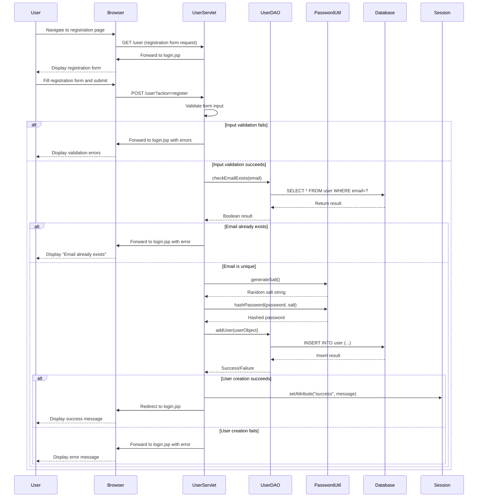
```mermaid
sequenceDiagram
    participant User
    participant Browser
    participant UserServlet
    participant UserDAO
    participant PasswordUtil
    participant Database
    participant Session
    
    User->>Browser: Navigate to registration page
    Browser->>UserServlet: GET /user (registration form request)
    UserServlet->>Browser: Forward to login.jsp
    Browser-->>User: Display registration form
    
    User->>Browser: Fill registration form and submit
    Browser->>UserServlet: POST /user?action=register
    
    UserServlet->>UserServlet: Validate form input
    alt Input validation fails
        UserServlet->>Browser: Forward to login.jsp with errors
        Browser-->>User: Display validation errors
    else Input validation succeeds
        UserServlet->>UserDAO: checkEmailExists(email)
        UserDAO->>Database: SELECT * FROM user WHERE email=?
        Database-->>UserDAO: Return result
        UserDAO-->>UserServlet: Boolean result
        
        alt Email already exists
            UserServlet->>Browser: Forward to login.jsp with error
            Browser-->>User: Display "Email already exists"
        else Email is unique
            UserServlet->>PasswordUtil: generateSalt()
            PasswordUtil-->>UserServlet: Random salt string
            UserServlet->>PasswordUtil: hashPassword(password, salt)
            PasswordUtil-->>UserServlet: Hashed password
            
            UserServlet->>UserDAO: addUser(userObject)
            UserDAO->>Database: INSERT INTO user (...)
            Database-->>UserDAO: Insert result
            UserDAO-->>UserServlet: Success/Failure
            
            alt User creation succeeds
                UserServlet->>Session: setAttribute("success", message)
                UserServlet->>Browser: Redirect to login.jsp
                Browser-->>User: Display success message
            else User creation fails
                UserServlet->>Browser: Forward to login.jsp with error
                Browser-->>User: Display error message
            end
        end
    end
```

### 1.2 User Login Flow

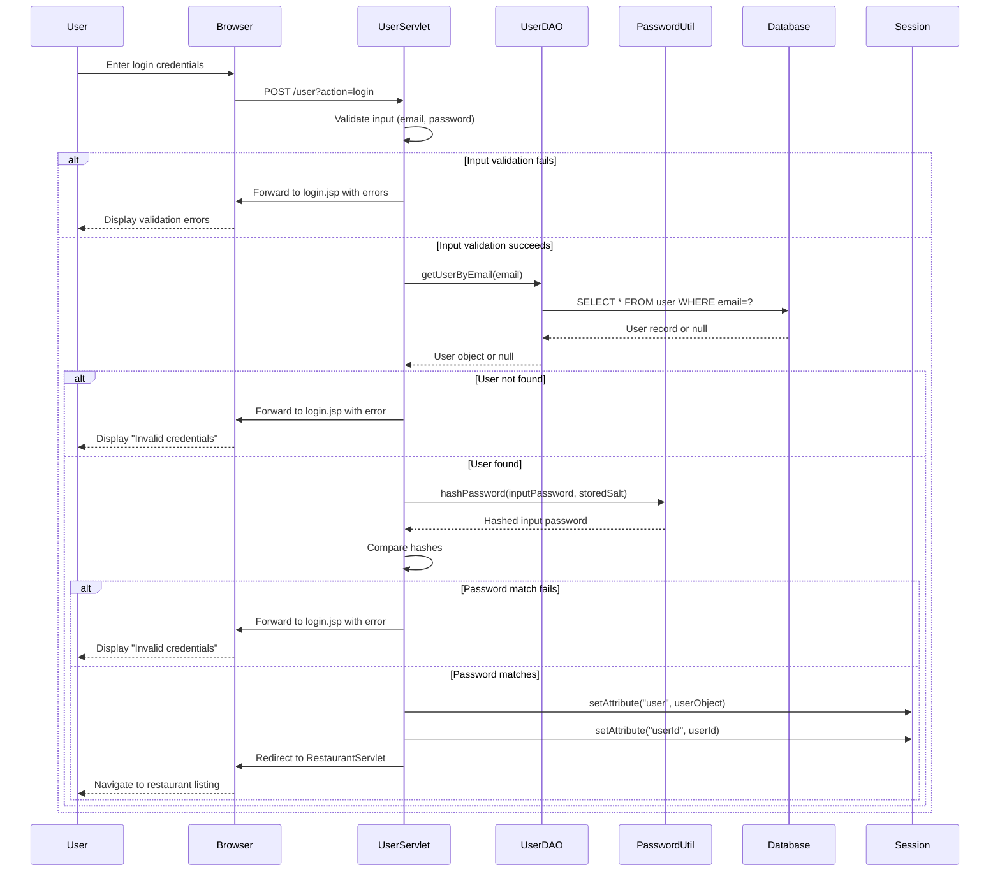
```mermaid
sequenceDiagram
    participant User
    participant Browser
    participant UserServlet
    participant UserDAO
    participant PasswordUtil
    participant Database
    participant Session
    
    User->>Browser: Enter login credentials
    Browser->>UserServlet: POST /user?action=login
    
    UserServlet->>UserServlet: Validate input (email, password)
    alt Input validation fails
        UserServlet->>Browser: Forward to login.jsp with errors
        Browser-->>User: Display validation errors
    else Input validation succeeds
        UserServlet->>UserDAO: getUserByEmail(email)
        UserDAO->>Database: SELECT * FROM user WHERE email=?
        Database-->>UserDAO: User record or null
        UserDAO-->>UserServlet: User object or null
        
        alt User not found
            UserServlet->>Browser: Forward to login.jsp with error
            Browser-->>User: Display "Invalid credentials"
        else User found
            UserServlet->>PasswordUtil: hashPassword(inputPassword, storedSalt)
            PasswordUtil-->>UserServlet: Hashed input password
            UserServlet->>UserServlet: Compare hashes
            
            alt Password match fails
                UserServlet->>Browser: Forward to login.jsp with error
                Browser-->>User: Display "Invalid credentials"
            else Password matches
                UserServlet->>Session: setAttribute("user", userObject)
                UserServlet->>Session: setAttribute("userId", userId)
                UserServlet->>Browser: Redirect to RestaurantServlet
                Browser-->>User: Navigate to restaurant listing
            end
        end
    end
```

## 2. Restaurant and Menu Browsing Sequence

### 2.1 Restaurant Listing Flow

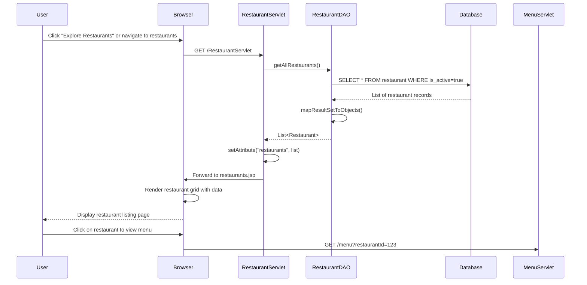
```mermaid
sequenceDiagram
    participant User
    participant Browser
    participant RestaurantServlet
    participant RestaurantDAO
    participant Database
    
    User->>Browser: Click "Explore Restaurants" or navigate to restaurants
    Browser->>RestaurantServlet: GET /RestaurantServlet
    
    RestaurantServlet->>RestaurantDAO: getAllRestaurants()
    RestaurantDAO->>Database: SELECT * FROM restaurant WHERE is_active=true
    Database-->>RestaurantDAO: List of restaurant records
    RestaurantDAO->>RestaurantDAO: mapResultSetToObjects()
    RestaurantDAO-->>RestaurantServlet: List<Restaurant>
    
    RestaurantServlet->>RestaurantServlet: setAttribute("restaurants", list)
    RestaurantServlet->>Browser: Forward to restaurants.jsp
    Browser->>Browser: Render restaurant grid with data
    Browser-->>User: Display restaurant listing page
    
    User->>Browser: Click on restaurant to view menu
    Browser->>MenuServlet: GET /menu?restaurantId=123
```

### 2.2 Menu Display Flow

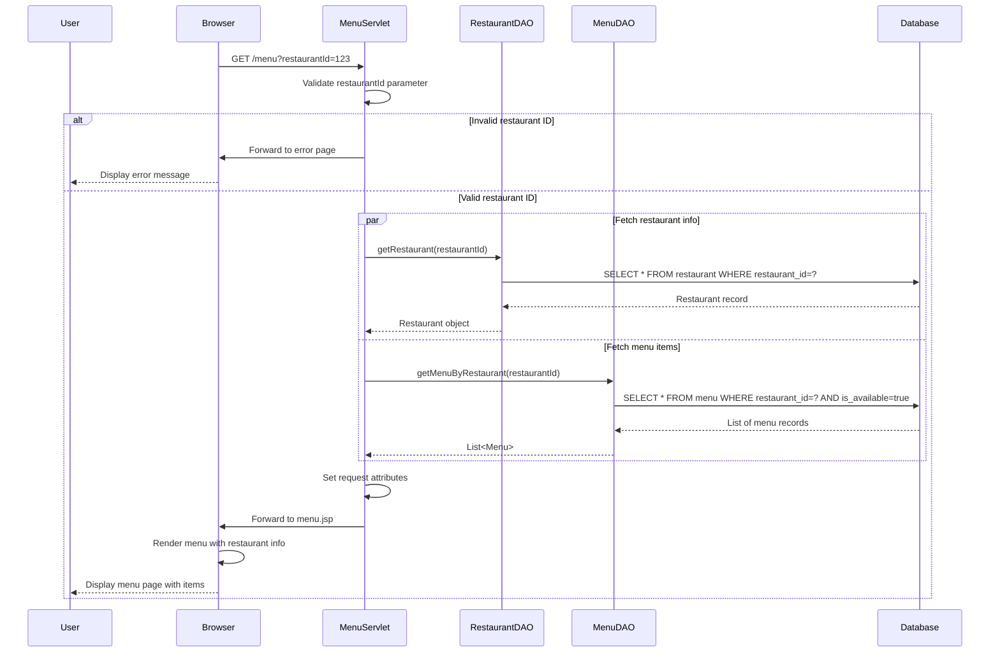
```mermaid
sequenceDiagram
    participant User
    participant Browser
    participant MenuServlet
    participant RestaurantDAO
    participant MenuDAO
    participant Database
    
    Browser->>MenuServlet: GET /menu?restaurantId=123
    
    MenuServlet->>MenuServlet: Validate restaurantId parameter
    alt Invalid restaurant ID
        MenuServlet->>Browser: Forward to error page
        Browser-->>User: Display error message
    else Valid restaurant ID
        par Fetch restaurant info
            MenuServlet->>RestaurantDAO: getRestaurant(restaurantId)
            RestaurantDAO->>Database: SELECT * FROM restaurant WHERE restaurant_id=?
            Database-->>RestaurantDAO: Restaurant record
            RestaurantDAO-->>MenuServlet: Restaurant object
        and Fetch menu items
            MenuServlet->>MenuDAO: getMenuByRestaurant(restaurantId)
            MenuDAO->>Database: SELECT * FROM menu WHERE restaurant_id=? AND is_available=true
            Database-->>MenuDAO: List of menu records
            MenuDAO-->>MenuServlet: List<Menu>
        end
        
        MenuServlet->>MenuServlet: Set request attributes
        MenuServlet->>Browser: Forward to menu.jsp
        Browser->>Browser: Render menu with restaurant info
        Browser-->>User: Display menu page with items
    end
```

## 3. Shopping Cart Management Sequence

### 3.1 Add Item to Cart Flow

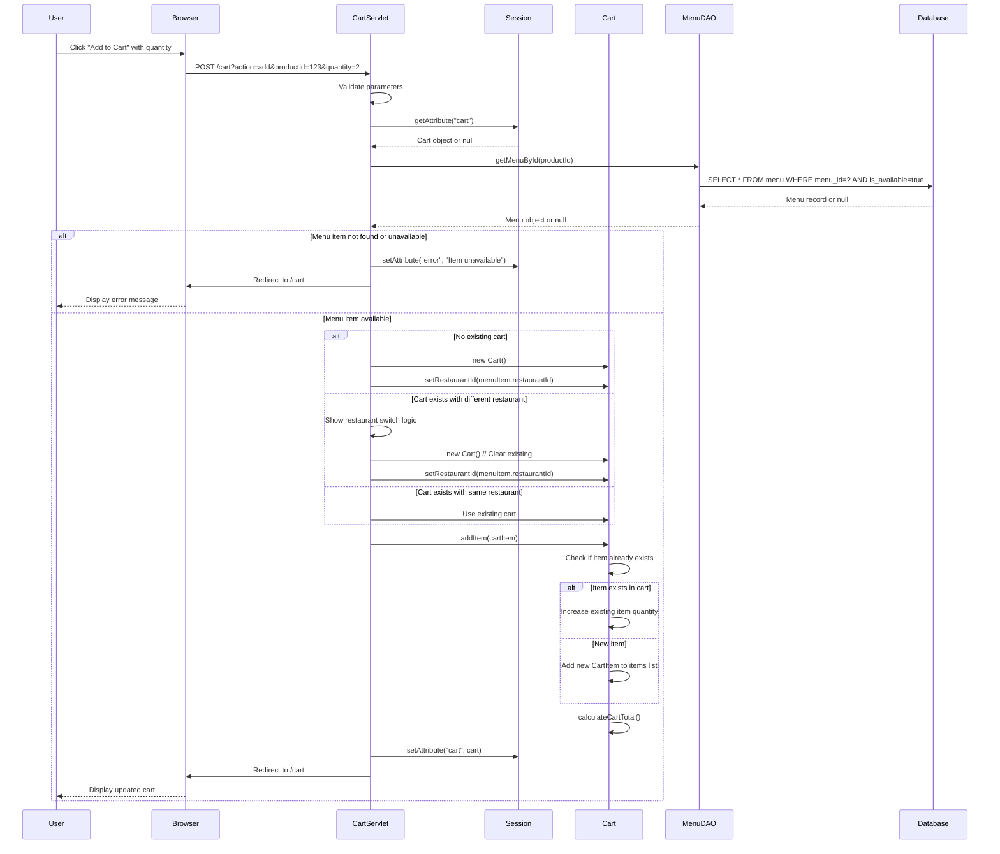
```mermaid
sequenceDiagram
    participant User
    participant Browser
    participant CartServlet
    participant Session
    participant Cart
    participant MenuDAO
    participant Database
    
    User->>Browser: Click "Add to Cart" with quantity
    Browser->>CartServlet: POST /cart?action=add&productId=123&quantity=2
    
    CartServlet->>CartServlet: Validate parameters
    CartServlet->>Session: getAttribute("cart")
    Session-->>CartServlet: Cart object or null
    
    CartServlet->>MenuDAO: getMenuById(productId)
    MenuDAO->>Database: SELECT * FROM menu WHERE menu_id=? AND is_available=true
    Database-->>MenuDAO: Menu record or null
    MenuDAO-->>CartServlet: Menu object or null
    
    alt Menu item not found or unavailable
        CartServlet->>Session: setAttribute("error", "Item unavailable")
        CartServlet->>Browser: Redirect to /cart
        Browser-->>User: Display error message
    else Menu item available
        alt No existing cart
            CartServlet->>Cart: new Cart()
            CartServlet->>Cart: setRestaurantId(menuItem.restaurantId)
        else Cart exists with different restaurant
            CartServlet->>CartServlet: Show restaurant switch logic
            CartServlet->>Cart: new Cart() // Clear existing
            CartServlet->>Cart: setRestaurantId(menuItem.restaurantId)
        else Cart exists with same restaurant
            CartServlet->>Cart: Use existing cart
        end
        
        CartServlet->>Cart: addItem(cartItem)
        Cart->>Cart: Check if item already exists
        alt Item exists in cart
            Cart->>Cart: Increase existing item quantity
        else New item
            Cart->>Cart: Add new CartItem to items list
        end
        
        Cart->>Cart: calculateCartTotal()
        CartServlet->>Session: setAttribute("cart", cart)
        CartServlet->>Browser: Redirect to /cart
        Browser-->>User: Display updated cart
    end
```

### 3.2 Update Cart Item Quantity Flow

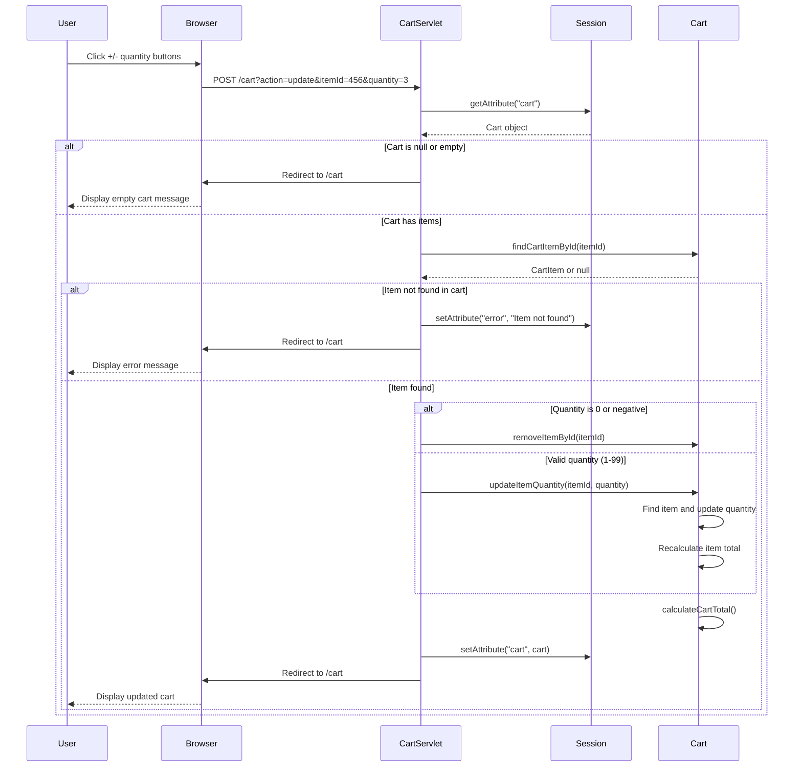
```mermaid
sequenceDiagram
    participant User
    participant Browser
    participant CartServlet
    participant Session
    participant Cart
    
    User->>Browser: Click +/- quantity buttons
    Browser->>CartServlet: POST /cart?action=update&itemId=456&quantity=3
    
    CartServlet->>Session: getAttribute("cart")
    Session-->>CartServlet: Cart object
    
    alt Cart is null or empty
        CartServlet->>Browser: Redirect to /cart
        Browser-->>User: Display empty cart message
    else Cart has items
        CartServlet->>Cart: findCartItemById(itemId)
        Cart-->>CartServlet: CartItem or null
        
        alt Item not found in cart
            CartServlet->>Session: setAttribute("error", "Item not found")
            CartServlet->>Browser: Redirect to /cart
            Browser-->>User: Display error message
        else Item found
            alt Quantity is 0 or negative
                CartServlet->>Cart: removeItemById(itemId)
            else Valid quantity (1-99)
                CartServlet->>Cart: updateItemQuantity(itemId, quantity)
                Cart->>Cart: Find item and update quantity
                Cart->>Cart: Recalculate item total
            end
            
            Cart->>Cart: calculateCartTotal()
            CartServlet->>Session: setAttribute("cart", cart)
            CartServlet->>Browser: Redirect to /cart
            Browser-->>User: Display updated cart
        end
    end
```
## 4. Checkout and Order Processing Sequence

### 4.1 Checkout Initialization Flow

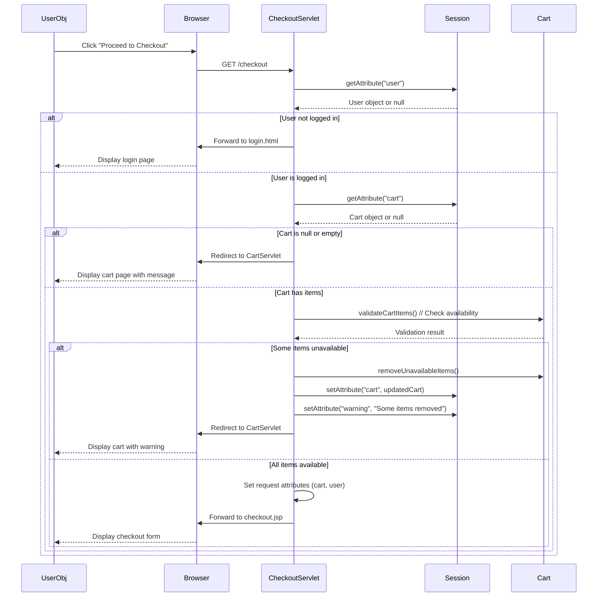
```mermaid
sequenceDiagram
    participant User
    participant Browser
    participant CheckoutServlet
    participant Session
    participant Cart
    participant User as UserObj
    
    User->>Browser: Click "Proceed to Checkout"
    Browser->>CheckoutServlet: GET /checkout
    
    CheckoutServlet->>Session: getAttribute("user")
    Session-->>CheckoutServlet: User object or null
    
    alt User not logged in
        CheckoutServlet->>Browser: Forward to login.html
        Browser-->>User: Display login page
    else User is logged in
        CheckoutServlet->>Session: getAttribute("cart")
        Session-->>CheckoutServlet: Cart object or null
        
        alt Cart is null or empty
            CheckoutServlet->>Browser: Redirect to CartServlet
            Browser-->>User: Display cart page with message
        else Cart has items
            CheckoutServlet->>Cart: validateCartItems() // Check availability
            Cart-->>CheckoutServlet: Validation result
            
            alt Some items unavailable
                CheckoutServlet->>Cart: removeUnavailableItems()
                CheckoutServlet->>Session: setAttribute("cart", updatedCart)
                CheckoutServlet->>Session: setAttribute("warning", "Some items removed")
                CheckoutServlet->>Browser: Redirect to CartServlet
                Browser-->>User: Display cart with warning
            else All items available
                CheckoutServlet->>CheckoutServlet: Set request attributes (cart, user)
                CheckoutServlet->>Browser: Forward to checkout.jsp
                Browser-->>User: Display checkout form
            end
        end
    end
```

### 4.2 Order Submission and Processing Flow

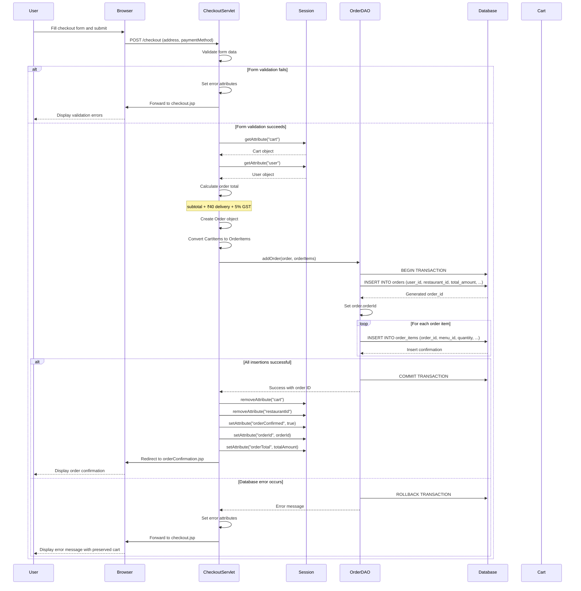
```mermaid
sequenceDiagram
    participant User
    participant Browser
    participant CheckoutServlet
    participant Session
    participant OrderDAO
    participant Database
    participant Cart
    
    User->>Browser: Fill checkout form and submit
    Browser->>CheckoutServlet: POST /checkout (address, paymentMethod)
    
    CheckoutServlet->>CheckoutServlet: Validate form data
    alt Form validation fails
        CheckoutServlet->>CheckoutServlet: Set error attributes
        CheckoutServlet->>Browser: Forward to checkout.jsp
        Browser-->>User: Display validation errors
    else Form validation succeeds
        CheckoutServlet->>Session: getAttribute("cart")
        Session-->>CheckoutServlet: Cart object
        CheckoutServlet->>Session: getAttribute("user")
        Session-->>CheckoutServlet: User object
        
        CheckoutServlet->>CheckoutServlet: Calculate order total
        Note over CheckoutServlet: subtotal + ₹40 delivery + 5% GST
        
        CheckoutServlet->>CheckoutServlet: Create Order object
        CheckoutServlet->>CheckoutServlet: Convert CartItems to OrderItems
        
        CheckoutServlet->>OrderDAO: addOrder(order, orderItems)
        OrderDAO->>Database: BEGIN TRANSACTION
        
        OrderDAO->>Database: INSERT INTO orders (user_id, restaurant_id, total_amount, ...)
        Database-->>OrderDAO: Generated order_id
        OrderDAO->>OrderDAO: Set order.orderId
        
        loop For each order item
            OrderDAO->>Database: INSERT INTO order_items (order_id, menu_id, quantity, ...)
            Database-->>OrderDAO: Insert confirmation
        end
        
        alt All insertions successful
            OrderDAO->>Database: COMMIT TRANSACTION
            OrderDAO-->>CheckoutServlet: Success with order ID
            
            CheckoutServlet->>Session: removeAttribute("cart")
            CheckoutServlet->>Session: removeAttribute("restaurantId")
            CheckoutServlet->>Session: setAttribute("orderConfirmed", true)
            CheckoutServlet->>Session: setAttribute("orderId", orderId)
            CheckoutServlet->>Session: setAttribute("orderTotal", totalAmount)
            
            CheckoutServlet->>Browser: Redirect to orderConfirmation.jsp
            Browser-->>User: Display order confirmation
            
        else Database error occurs
            OrderDAO->>Database: ROLLBACK TRANSACTION
            OrderDAO-->>CheckoutServlet: Error message
            
            CheckoutServlet->>CheckoutServlet: Set error attributes
            CheckoutServlet->>Browser: Forward to checkout.jsp
            Browser-->>User: Display error message with preserved cart
        end
    end
```

### 4.3 Order Confirmation Display Flow

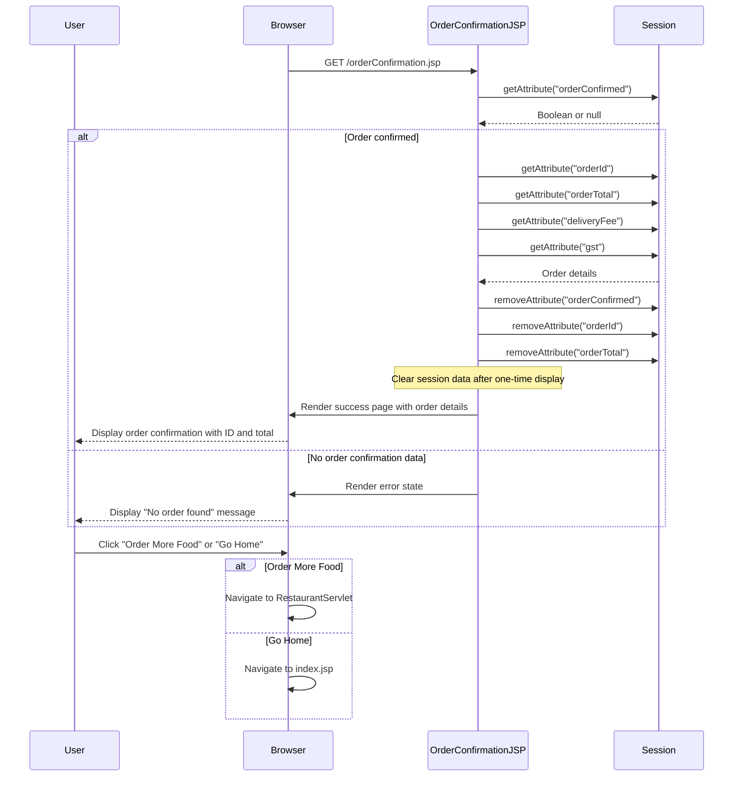
```mermaid
sequenceDiagram
    participant User
    participant Browser
    participant OrderConfirmationJSP
    participant Session
    
    Browser->>OrderConfirmationJSP: GET /orderConfirmation.jsp
    
    OrderConfirmationJSP->>Session: getAttribute("orderConfirmed")
    Session-->>OrderConfirmationJSP: Boolean or null
    
    alt Order confirmed
        OrderConfirmationJSP->>Session: getAttribute("orderId")
        OrderConfirmationJSP->>Session: getAttribute("orderTotal")
        OrderConfirmationJSP->>Session: getAttribute("deliveryFee")
        OrderConfirmationJSP->>Session: getAttribute("gst")
        Session-->>OrderConfirmationJSP: Order details
        
        OrderConfirmationJSP->>Session: removeAttribute("orderConfirmed")
        OrderConfirmationJSP->>Session: removeAttribute("orderId")
        OrderConfirmationJSP->>Session: removeAttribute("orderTotal")
        Note over OrderConfirmationJSP: Clear session data after one-time display
        
        OrderConfirmationJSP->>Browser: Render success page with order details
        Browser-->>User: Display order confirmation with ID and total
        
    else No order confirmation data
        OrderConfirmationJSP->>Browser: Render error state
        Browser-->>User: Display "No order found" message
    end
    
    User->>Browser: Click "Order More Food" or "Go Home"
    alt Order More Food
        Browser->>Browser: Navigate to RestaurantServlet
    else Go Home
        Browser->>Browser: Navigate to index.jsp
    end
```

## 5. Session Management Sequence

### 5.1 Session Creation and Management

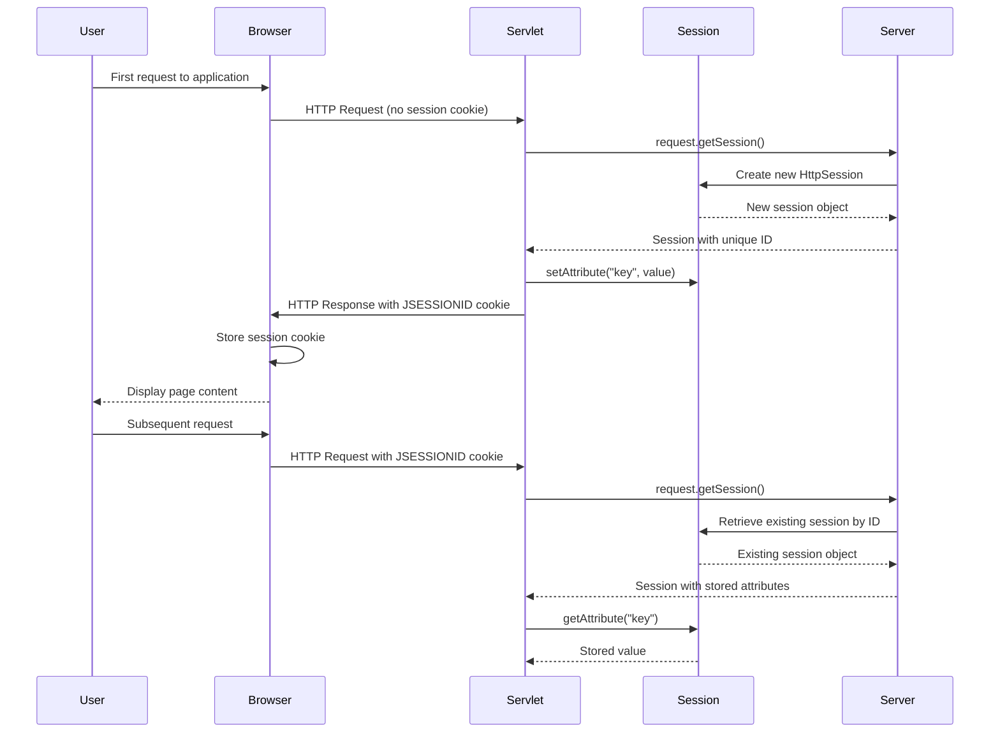
```mermaid
sequenceDiagram
    participant User
    participant Browser
    participant Servlet
    participant Session
    participant Server
    
    User->>Browser: First request to application
    Browser->>Servlet: HTTP Request (no session cookie)
    
    Servlet->>Server: request.getSession()
    Server->>Session: Create new HttpSession
    Session-->>Server: New session object
    Server-->>Servlet: Session with unique ID
    
    Servlet->>Session: setAttribute("key", value)
    Servlet->>Browser: HTTP Response with JSESSIONID cookie
    Browser->>Browser: Store session cookie
    Browser-->>User: Display page content
    
    User->>Browser: Subsequent request
    Browser->>Servlet: HTTP Request with JSESSIONID cookie
    Servlet->>Server: request.getSession()
    Server->>Session: Retrieve existing session by ID
    Session-->>Server: Existing session object
    Server-->>Servlet: Session with stored attributes
    
    Servlet->>Session: getAttribute("key")
    Session-->>Servlet: Stored value
```

### 5.2 Session Timeout and Cleanup

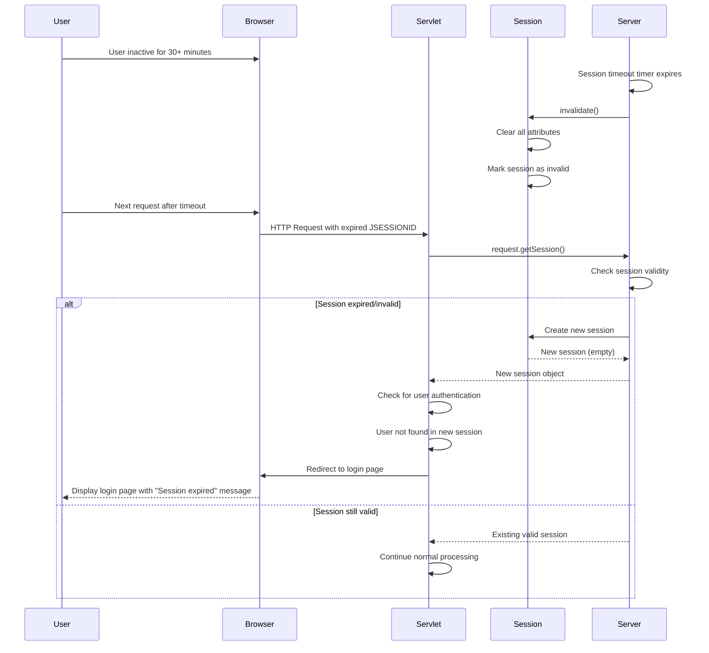
```mermaid
sequenceDiagram
    participant User
    participant Browser
    participant Servlet
    participant Session
    participant Server
    
    User->>Browser: User inactive for 30+ minutes
    Server->>Server: Session timeout timer expires
    Server->>Session: invalidate()
    Session->>Session: Clear all attributes
    Session->>Session: Mark session as invalid
    
    User->>Browser: Next request after timeout
    Browser->>Servlet: HTTP Request with expired JSESSIONID
    Servlet->>Server: request.getSession()
    Server->>Server: Check session validity
    
    alt Session expired/invalid
        Server->>Session: Create new session
        Session-->>Server: New session (empty)
        Server-->>Servlet: New session object
        
        Servlet->>Servlet: Check for user authentication
        Servlet->>Servlet: User not found in new session
        Servlet->>Browser: Redirect to login page
        Browser-->>User: Display login page with "Session expired" message
        
    else Session still valid
        Server-->>Servlet: Existing valid session
        Servlet->>Servlet: Continue normal processing
    end
```

## 6. Error Handling Sequence

### 6.1 Database Connection Error Flow

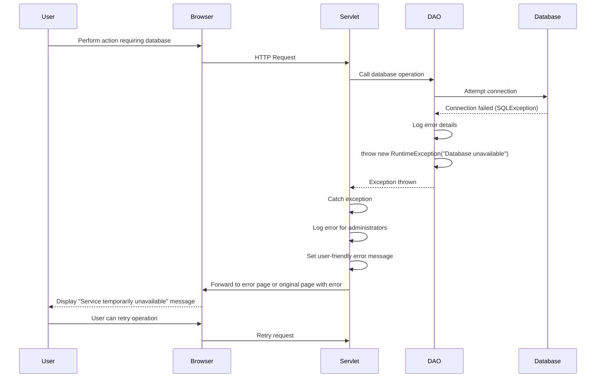
```mermaid
sequenceDiagram
    participant User
    participant Browser
    participant Servlet
    participant DAO
    participant Database
    
    User->>Browser: Perform action requiring database
    Browser->>Servlet: HTTP Request
    
    Servlet->>DAO: Call database operation
    DAO->>Database: Attempt connection
    Database-->>DAO: Connection failed (SQLException)
    
    DAO->>DAO: Log error details
    DAO->>DAO: throw new RuntimeException("Database unavailable")
    DAO-->>Servlet: Exception thrown
    
    Servlet->>Servlet: Catch exception
    Servlet->>Servlet: Log error for administrators
    Servlet->>Servlet: Set user-friendly error message
    
    Servlet->>Browser: Forward to error page or original page with error
    Browser-->>User: Display "Service temporarily unavailable" message
    
    User->>Browser: User can retry operation
    Browser->>Servlet: Retry request
```

### 6.2 Validation Error Handling Flow

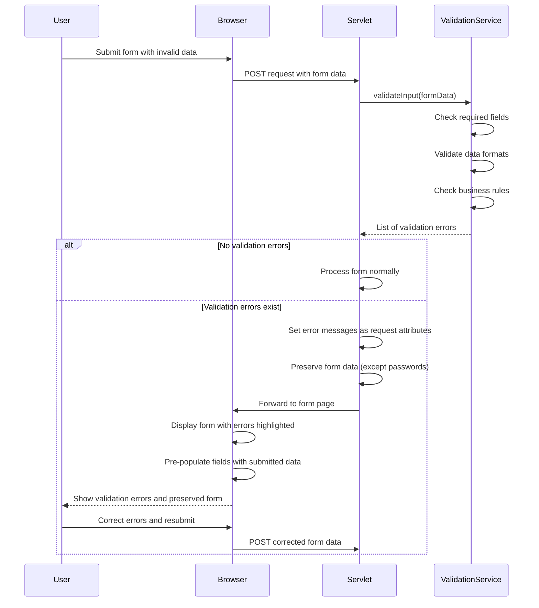
```mermaid
sequenceDiagram
    participant User
    participant Browser
    participant Servlet
    participant ValidationService
    
    User->>Browser: Submit form with invalid data
    Browser->>Servlet: POST request with form data
    
    Servlet->>ValidationService: validateInput(formData)
    ValidationService->>ValidationService: Check required fields
    ValidationService->>ValidationService: Validate data formats
    ValidationService->>ValidationService: Check business rules
    ValidationService-->>Servlet: List of validation errors
    
    alt No validation errors
        Servlet->>Servlet: Process form normally
    else Validation errors exist
        Servlet->>Servlet: Set error messages as request attributes
        Servlet->>Servlet: Preserve form data (except passwords)
        Servlet->>Browser: Forward to form page
        
        Browser->>Browser: Display form with errors highlighted
        Browser->>Browser: Pre-populate fields with submitted data
        Browser-->>User: Show validation errors and preserved form
        
        User->>Browser: Correct errors and resubmit
        Browser->>Servlet: POST corrected form data
    end
```

## 7. Performance Optimization Sequence

### 7.1 Database Connection Management

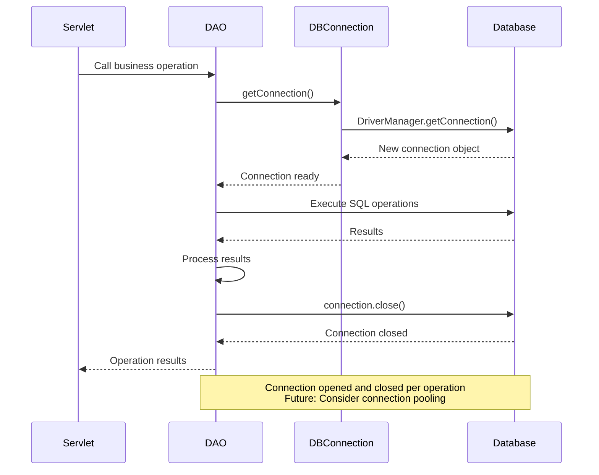
```mermaid
sequenceDiagram
    participant Servlet
    participant DAO
    participant DBConnection
    participant Database
    
    Servlet->>DAO: Call business operation
    DAO->>DBConnection: getConnection()
    
    DBConnection->>Database: DriverManager.getConnection()
    Database-->>DBConnection: New connection object
    DBConnection-->>DAO: Connection ready
    
    DAO->>Database: Execute SQL operations
    Database-->>DAO: Results
    
    DAO->>DAO: Process results
    DAO->>Database: connection.close()
    Database-->>DAO: Connection closed
    DAO-->>Servlet: Operation results
    
    Note over DAO, Database: Connection opened and closed per operation<br/>Future: Consider connection pooling
```

### 7.2 Cart Operations Optimization

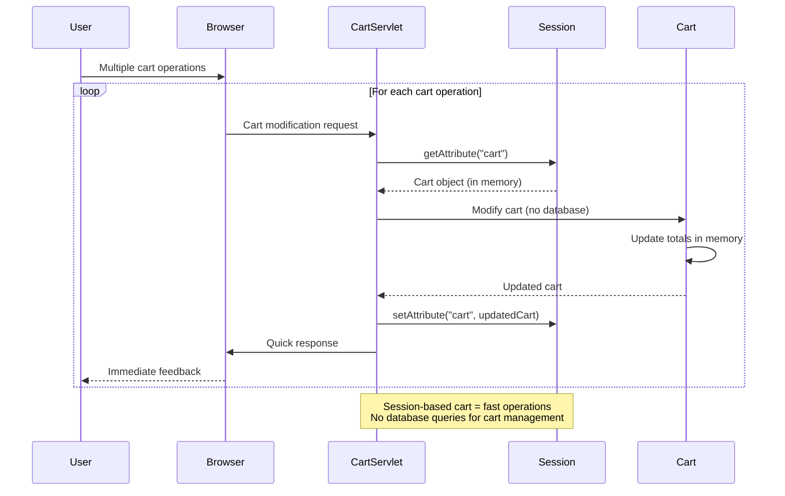
```mermaid
sequenceDiagram
    participant User
    participant Browser
    participant CartServlet
    participant Session
    participant Cart
    
    User->>Browser: Multiple cart operations
    
    loop For each cart operation
        Browser->>CartServlet: Cart modification request
        CartServlet->>Session: getAttribute("cart")
        Session-->>CartServlet: Cart object (in memory)
        
        CartServlet->>Cart: Modify cart (no database)
        Cart->>Cart: Update totals in memory
        Cart-->>CartServlet: Updated cart
        
        CartServlet->>Session: setAttribute("cart", updatedCart)
        CartServlet->>Browser: Quick response
        Browser-->>User: Immediate feedback
    end
    
    Note over CartServlet, Session: Session-based cart = fast operations<br/>No database queries for cart management
```

---

**Document Status:** Approved  
**Next Review Date:** Q2 2025  
**Architecture Team:** Development Team, Technical Leadership